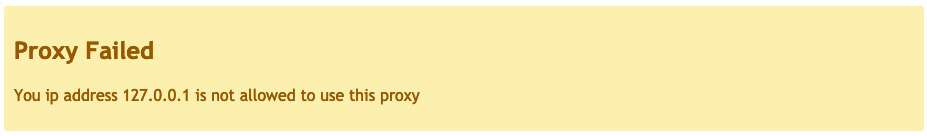
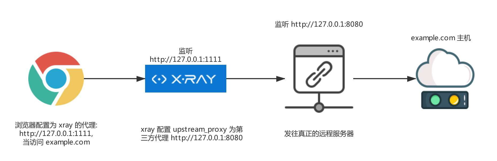

这一部分主要介绍配置项中 `mitm` 部分相关的内容。

```yaml
mitm:
  ca_cert: ./ca.crt # ca 根证书
  ca_key: ./ca.key # ca 根秘钥
  auth:
    username: ""
    password: ""
  restriction:
    includes: # 允许扫描的域
    - '*' # 表示允许所有的域名和 path
    - "example.com/admin*" # 表示允许 example.com 下的 /admin 开头的 path
    excludes:
    - '*google*'
    - '*github*'
    - '*.gov.cn'
    - '*.edu.cn'
  queue:
    max_length: 10000
  proxy_header:
    via: "" # 如果不为空，proxy 将添加类似 Via: 1.1 $some-value-$random 的 http 头
    x_forwarded: false # 是否添加 X-Forwarded-{For,Host,Proto,Url} 四个 http 头
  upstream_proxy: "" # mitm 的全部流量继续使用 proxy
```

## 抓取 HTTPS 流量
对应于 `ca_cert` 和 `ca_key` 两项配置。

和 burp 类似，抓取 https 流量需要信任一个根证书，这个根证书可以自行生成，也可用下列自带的命令生成:

```
xray genca
```

运行后将在当前目录生成 `ca.key` 和 `ca.crt`， 用户需要手动信任 `ca.crt`并按需调整配置中的文件位置，操作完成后就可以正常抓取 https 流量了。

> Firefox 浏览器没有使用系统的根证书管理器，意味着使用 Firefox 时需要单独在该浏览内导入证书才可生效。
> 对于移动端等，可以在挂代理之后访问 `http://xray/` 然后下载根证书。

## 代理启用密码保护
对应于 `auth` 中的配置。

xray 支持给代理配置基础认证的密码，当设置好 `auth` 中的 `username` 和 `password` 后，使用代理时浏览器会弹框要求输出用户名密码，输入成功后代理才可正常使用。

## 限制漏洞扫描的范围

在 mitm 的配置中的 `restrction` 项指示本次漏洞的 URI 限制。

1. `includes`表示只扫描哪些域和路径。比如 `*.example.com` 只扫描 `example.com` 的子域
1. `excludes` 表示不扫描哪些域和路径。比如 `t.example.com` 表示不扫描 `t.example.com`

两个都配置的情况下会取交集，这两个配置常用于想要过滤代理中的某些域，或者只想扫描某个域的请求时。

两项配置都支持 path 过滤，如果输入的中有 `/`, 那么 `/` 后面的表达式就是 path 的过滤。可以对照如下例子理解:
```yaml
includes:
  - 'example.com/test' # 表示允许 example.com/test 这一个路径
  - "example.com/admin*" # 表示允许 example.com 下的 /admin 开头的所有 path 
```

!> 注意： 这里的 includes 和 excludes 均不支持端口号，如果加上将导致限制失效！

## 限制允许使用该代理的 IP

配置中的 `allow_ip_range` 项可以限制哪些 IP 可以使用该代理。支持单个 IP 和 CIDR 格式的地址，如：
```yaml
allow_ip_range: ["127.0.0.1","192.168.1.1/24"]
```
留空则允许所有地址访问，如果来源 IP 没有在配置的地址内，使用者会显示这样的错误:


## 队列长度配置

```yaml
  queue:
    max_length: 3000
```

在做被动扫描时，xray 收到一个请求可能要发出去上百个请求进行扫描，所以获取请求和消耗请求的速度不一定匹配，这是一个经典的生产者消费者问题，如果生产消费速度不匹配，就需要一个中间的队列来临时存储，这个队列的大小就是 `max_length`。

xray 将每 10s 打印一下当前任务队列长度，一旦堆积的数量达到 `max_length`，代理将会 “卡住”，新请求无法通过，等待队列中的请求被处理后再继续生效。默认配置的 10000 表示最多允许堆积 10000 个请求。

如果发现队列长度经常变满，可能是扫描速度太慢，可以尝试减少请求超时的时间和增加最大并发请求数，详见 `http` 配置章节。

如果 `max_length` 设置的过大，会造成 xray 内存占用过大，甚至可能会造成内存不足 OOM 进程崩溃。比如我们假设一个 http 请求加响应为 20kb，那 3000 个请求理论上内存占用至少为 60Mb，实际场景下可能会比理论值还要大很多。

更多信息可以参见[扫描速度](guide/speed)。

## 代理请求头配置 `proxy_header`

```
proxy_header:
    via: "" # 如果不为空，proxy 将添加类似 Via: 1.1 $some-value-$random 的 http 头
    x_forwarded: false # 是否添加 X-Forwarded-{For,Host,Proto,Url} 四个 http 头
```

如果开启 proxy_header，代理会添加 `via` 头和 `X-Forwarded-*` 系列头。如果在请求中就已经存在了同名的 HTTP 头，那么将会追加在后面。

比如 `curl http://127.0.0.1:1234 -H "Via: test" -H "X-Forwarded-For: 1.2.3.4" -v`，后端实际收到的请求将会是

```http
GET / HTTP/1.1
Host: 127.0.0.1:1234
User-Agent: curl/7.54.0
Accept: */*
Via: test, 1.1 xray-1fe7f9e5241b2b150f32
X-Forwarded-For: 1.2.3.4, 127.0.0.1
X-Forwarded-Host: 127.0.0.1:1234
X-Forwarded-Proto: http
X-Forwarded-Url: http://127.0.0.1:1234/
Accept-Encoding: gzip
```

## 代理的代理 `upstream_proxy`

!> 该项配置仅对 http 代理本身生效，不对漏洞扫描发出的请求生效。如果想配置漏洞扫描时的代理，请参照配置文件 `http` 部分的配置。

假如启动 xray 时配置的 listen 为 `127.0.0.1:1111`，`upstream_proxy` 为 `http://127.0.0.1:8080`, 那么浏览器设置代理为 `http://127.0.0.1:1111`，整体数据流如下:



再次重申下，该配置仅影响代理本身，不会影响插件在漏洞探测时的发包行为，如果想代理漏洞探测的，请参照接下来的 [HTTP配置](./http.md) 的部分!
