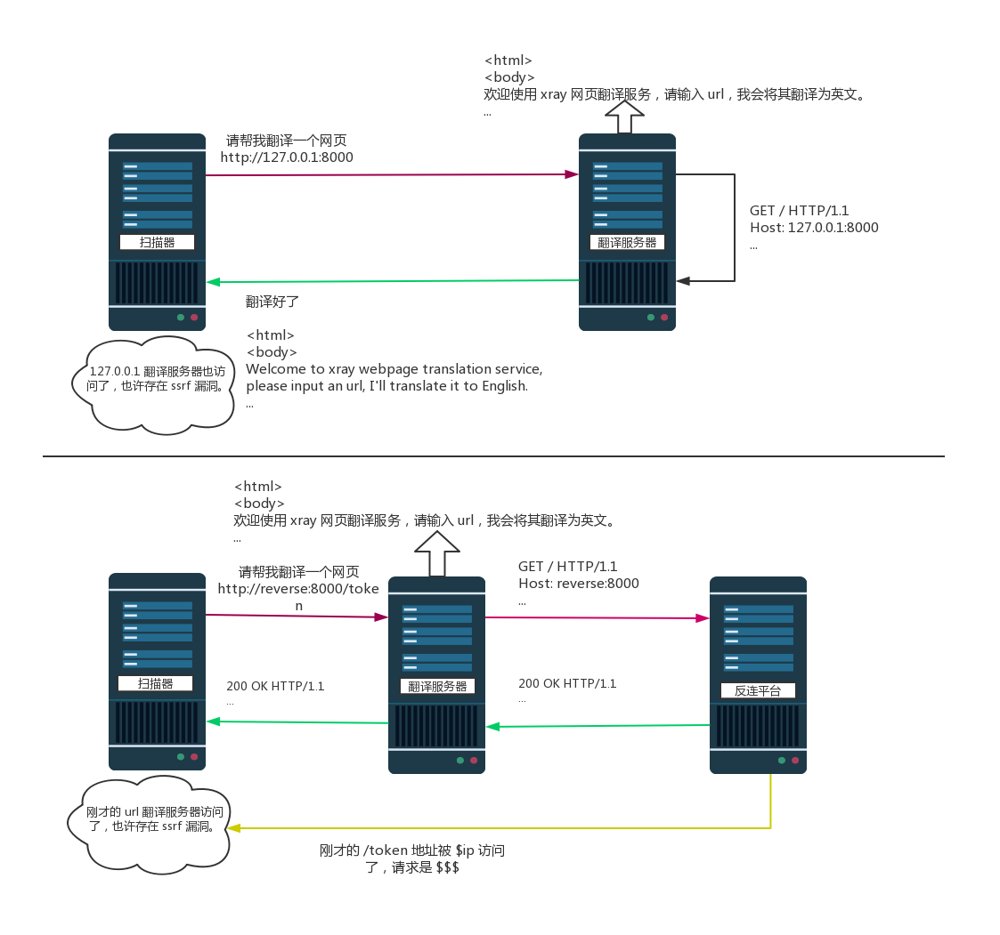
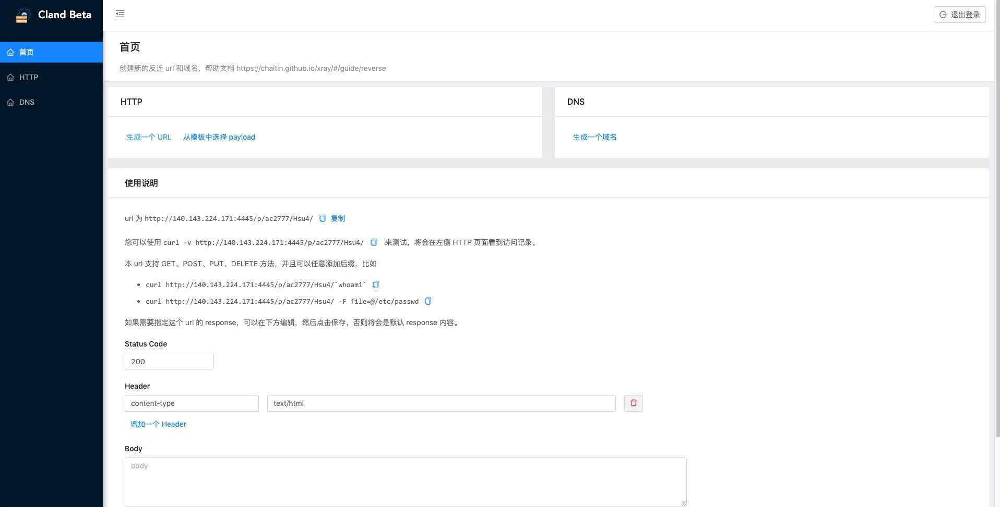
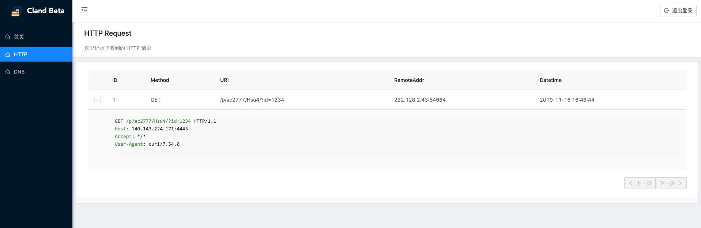

# 反连平台

## 什么是 ssrf



## 反连平台配置项目

```yaml
reverse:
  db_file_path: ""
  token: ""
  http:
    enabled: true
    listen_ip: 127.0.0.1
    listen_port: ""
  dns:
    enabled: false
    listen_ip: 127.0.0.1
    domain: ""
    is_domain_name_server: false
    # 静态解析规则
    resolve:
    - type: A # A, AAAA, TXT 三种
      record: localhost
      value: 127.0.0.1
      ttl: 60
  rmi:
    enabled: true
    listen_ip: 127.0.0.1
    listen_port: ""
  client:
    http_base_url: ""
    dns_server_ip: ""
    rmi_server_addr: ""
    remote_server: false
```
 - db_file_path 用于存储反连平台获取的请求信息，用于后续查询，默认为空，将存储在系统临时文件夹。
 - token 用于防止 api 被非法调用，默认为空，将自动生成。
 - http
   - listen_ip 监听的 ip
   - listen_port 默认为空，将自动选择，要注意本端口被防火墙放行，尤其是自动选择端口的时候。
 - dns（如果启用，可能需要权限才能监听 53 端口）
   - listen_ip 监听的 ip
   - domain 在 dns 查询的时候的一级域名，默认为空，将使用随机域名。
   - resolve 的配置类似常见的 dns 配置，如果反连平台收到配置的域名的解析请求，将按照配置的结果直接返回。
   - is_domain_name_server 如果上述域名的 ns 服务器就是反连平台的地址，那么直接使用 `dig random.domain.com` 就可以让 dns 请求到反连平台，否则需要 `dig random.domain.com @reverse-server-ip` 指定 dns 服务器才可以。本配置项是指有没有配置 ns 服务器为反连平台的地址，用于提示扫描器内部 payload 的选择。
 - rmi (目前只有高级版的 fastjson 插件需要)
   - listen_ip 监听的 ip
   - listen_port 默认为空，将自动选择，要注意本端口被防火墙放行，尤其是自动选择端口的时候。
 - client
   - base_url 是客户端访问的时候使用，详见下方的场景。
   - remote_server 是客户端访问的时候，如何和反连平台建立连接，详见下方的场景。
   - dns_server_ip 是客户端发起 dns 查询的时候，使用的 ip，详见下方场景。
   - rmi_server_addr 是客户端生成 rmi 地址的时候，使用的地址，比如 `domain.com:1234`，和下方场景基本一致，不再单独讲解。

## 管理界面

新版的反连平台新增了管理界面，可以访问反连平台 http 地址，url 为 `/cland/`。

功能包括

 - 生成自定义 url，并记录访问记录
 - 生成自定义域名，并记录解析记录
 - 使用平台预制 payload，记录抓取的数据





## 场景分析

!> 注意，下面的配置删除了没有修改的项目

### 场景1 - xray 和被扫描目标可以使用 ip 双向互联

可以使用默认配置，配置监听 ip 就可以，以 `192.168.1.2` 为例。

因为下方端口留空，xray 将随机选择一个端口，以 24568 为例。

```yaml
reverse:
  http:
    enabled: true
    listen_ip: 192.168.1.2
  dns:
    enabled: true
    listen_ip: 192.168.1.2
  rmi:
    enabled: true
    listen_ip: 192.168.1.2
```

扫描期间，用于连接反连平台的 url 将为 `http://192.168.1.2:24678/url`。

### 场景2 - xray listen 的地址和被扫描目标访问的地址不一样

比如一些云主机，虽然公网 ip 可以访问，但是本地并无法直接 listen 那个 ip

首先要获取到云主机的外网 ip，以 `100.100.100.100` 为例。

```yaml
reverse:
  http:
    enabled: true
    listen_ip: 0.0.0.0
  dns:
    enabled: true
    listen_ip: 0.0.0.0
  rmi:
    enabled: true
    listen_ip: 0.0.0.0
  client:
    http_base_url: "http://100.100.100.100:${port}"
    dns_server_ip: "100.100.100.100"
    rmi_server_addr: "100.100.100.100:${port}"
```

如果将使用域名代替 ip 地址，对照替换即可。

### 场景3 - xray 可以访问扫描目标，但是反向不行

这是非常常见的情况，比如在办公网运行 xray，扫描生产网的目标。

这时候需要在双方都可以访问到个的地方也部署一份反连平台，比如一台公网云主机，然后扫描器和靶站都去连接它。

对于单独部署的反连平台，使用 `./xray reverse` 启动，配置如下，以公网云主机 ip 地址 `100.100.100.100`，端口 `80`(http) 和 `8080`(rmi) 为例。

```yaml
reverse:
  db_file_path: "reverse.db"
  token: "a_verrrry_long_token"
  http:
    listen_ip: 0.0.0.0
    listen_port: "80"
  dns:
    enabled: true
    listen_ip: 0.0.0.0
    domain: "domain.com"
  rmi:
    enabled: true
    listen_ip: 0.0.0.0
    listen_port: 8088
```

对于扫描器端，配置如下。

```yaml
reverse:
  token: "a_verrrry_long_token"
  http:
    enabled: false
  dns:
    enabled: false
    domain: "domain.com"
  rmi:
    enabled: false
  client:
    http_base_url: "http://100.100.100.100:80"
    dns_server_ip: "100.100.100.100"
    rmi_server_addr: "100.100.100.100:8088"
    remote_server: true
```

要注意的是，两边的 xray 请使用相同版本的，否则可能存在 api 不兼容的问题。
