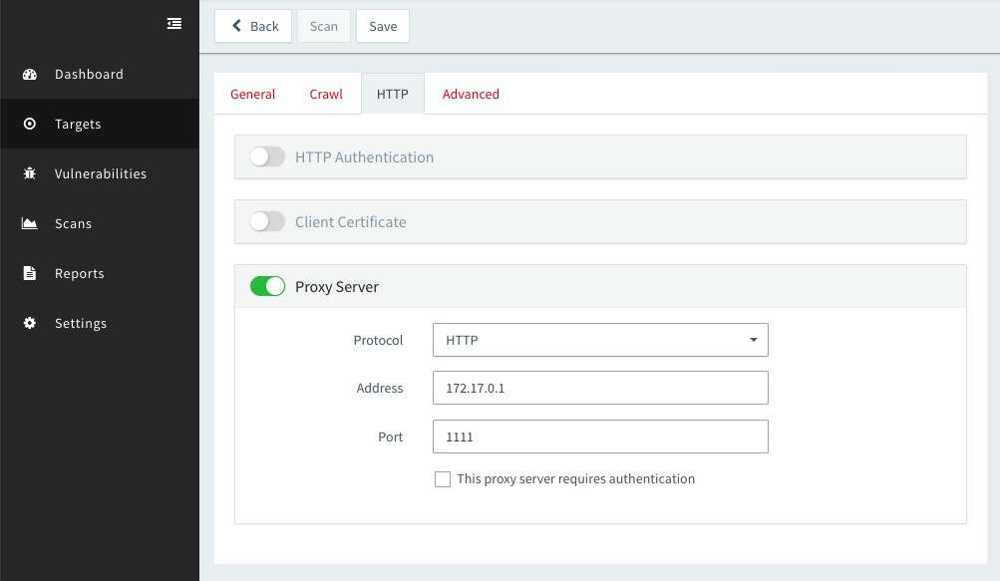

# xray 与 awvs 爬虫联动

awvs 的爬虫很好用，支持表单分析和单页应用的爬取，xray 的扫描能力比较强，速度也更快。awvs 和 xray 搭配使用则是如虎添翼。这里演示的是扫描 awvs 的在线靶站 http://testphp.vulnweb.com/

首先启动 xray 的被动代理，下面的命令将启动一个监听在所有网卡 1111 端口的 HTTP 代理, 并将扫描结果保存在 `awvs.html` 内。

```
./xray webscan --listen 0.0.0.0:1111 --html-output awvs.html
```

以 awvs 12 web 版为例，登入管理页后，点击 `Targets`, 然后点击 `Add Target` 添加扫描目标:


然后切换到 `HTTP` 的部分，填写 xray 的 HTTP 代理。



地址需要根据实际情况填写，需要填写为 awvs 所在机器（容器）内能够访问到 xray 代理的地址。如果 xray 在外网，则填写为外网主机的 IP 地址。端口填写为上面启动时设置的端口号。

其他项可以按需调整或保持默认，然后点击 `scan` 按钮，按图示选择 `Crawl Only` 即仅使用爬虫，然后点击 Create Scan 就可以开始扫描了。


检查 xray 的界面有没有在扫描，如果有类似下图的结果说明工作正常，等待扫描完成即可。


扫描完成后可以查看 `avws.html` 查看漏洞详情。