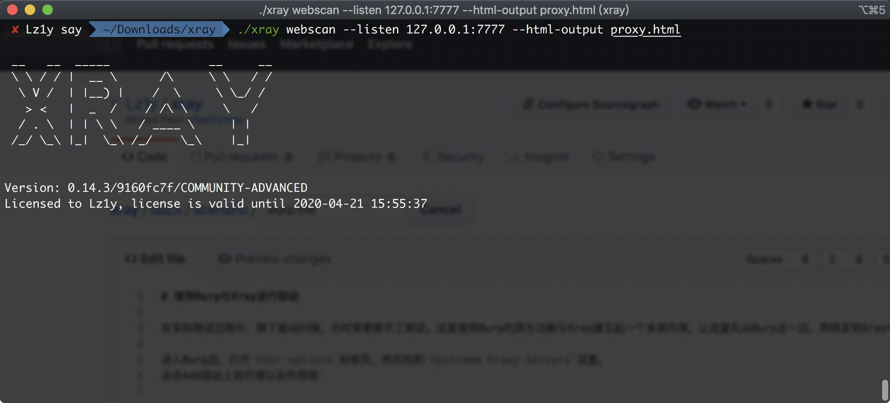
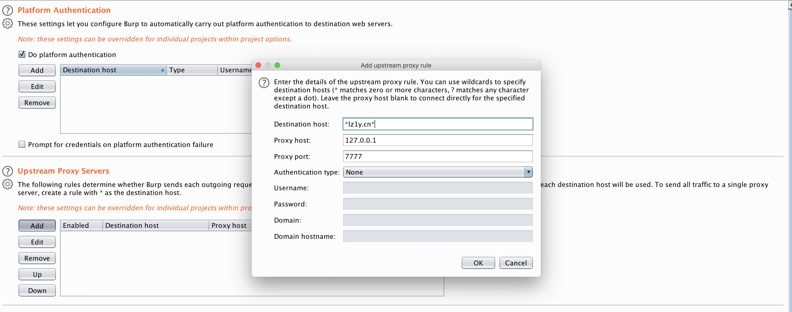
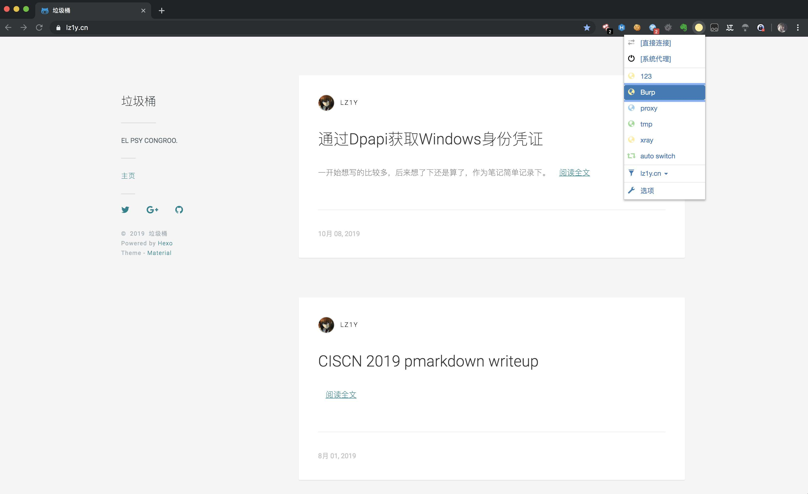
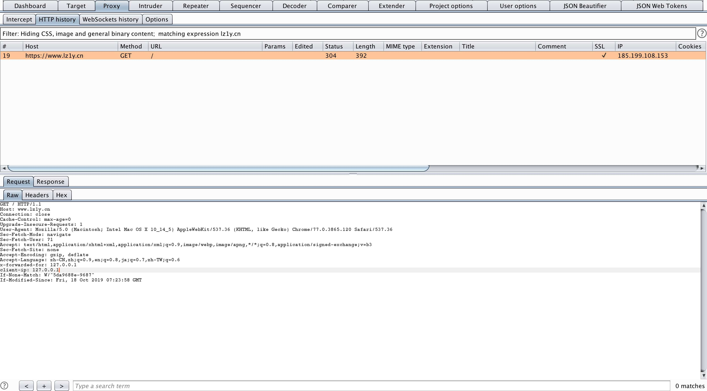
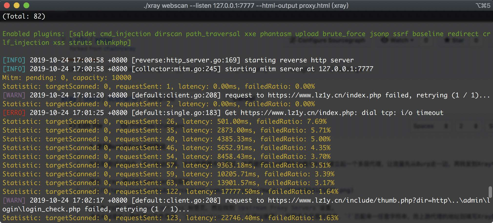

# 使用 Burp 与 xray 进行联动

作者 [Lz1y](https://github.com/Lz1y)
  
在实际测试过程中，除了被动扫描，也时常需要手工测试。这里使用 Burp 的原生功能与 xray 建立起一个多层代理，让流量从 Burp 转发到 xray 中。  

首先 xray 建立起 webscan 的监听

  
进入 Burp 后，打开 `User options` 标签页，然后找到 `Upstream Proxy Servers` 设置。

点击 `Add` 添加上游代理以及作用域，`Destination host`处可以使用`*`匹配多个任意字符串，`?`匹配单一任意字符串，而上游代理的地址则填写 xray
的监听地址。

接下来，在浏览器端使用 Burp 的代理地址

 

此时，请求已经通过了 Burp

  

转发到了 xray 中

 

至此，联动成功。
