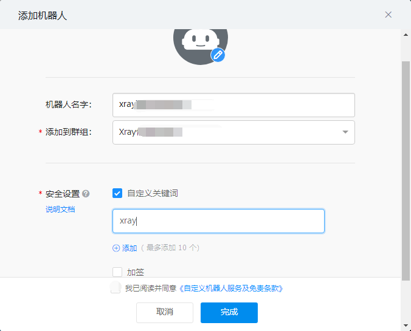
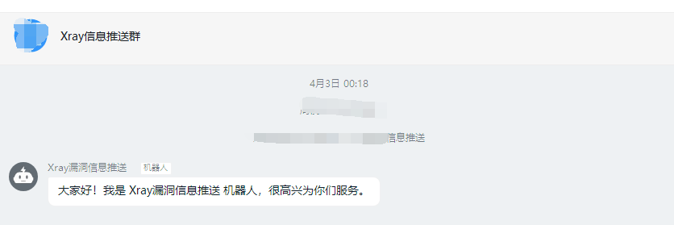
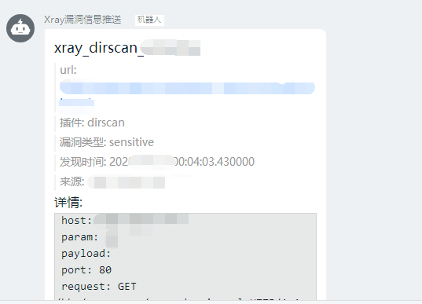

# xray辅助工具-推送消息到钉钉

## 1、初衷
之前使用方糖进行接收漏洞信息，在开启了分布式扫描后，推送的信息过多，导致方糖账号不能使用了，需要交保护费才给开通，于是，切换到钉钉上。

## 2、申请钉钉机器人
登录钉钉后，点击`自己的图像`-->`机器人管理`-->`自定义`-->`添加`，创建自己的机器人。

定义一个推送关键字，我定义的是`xray`

> 前提需要创建一个至少3人的聊天群组。

如下所示：





以上，机器人的申请完成了。

## 3、编写推送程序

推送消息的程序已经编写好了，源代码如下：

> python版本是python3
>
> 需要填写自己的机器人token
>
> 包含xray的扫描队列信息，URL：/getStatus

```
# -*-coding: utf-8 -*-
from flask import Flask, request
import requests
import datetime
import logging
import json

app = Flask(__name__)

ding_Token = 'xxxxxxxx'

xrayStatus = {}
allUrls = 0
scannedUrls = 0
avgRspTime = 0

def getDetail(detail={}):
    detailInfo = ''
    try:
        for key in detail.keys():
            detailInfo = detailInfo + str(key) + ": " + str(detail.get(key)) + "\n\t"
        return detailInfo
    except Exception as e:
        logging.exception(e)
    finally:
        return detailInfo

@app.route('/webhook', methods=['POST', 'GET'])
def xray_webhook():
    if request.method == 'POST':
        vuln = request.json
        clientip = request.remote_addr
        if "vuln_class" not in vuln:
            '''
            xrayStatus={'1.2.3.4':{"allUrls": 0, "scannedUrls": 0, "avgRspTime": 0}
            '''
            allUrls = vuln["num_found_urls"]
            scannedUrls = vuln["num_scanned_urls"]
            avgRspTime = vuln["average_response_time"]
            xrayStatus[clientip] = {"allUrls": allUrls, "scannedUrls": scannedUrls, "avgRspTime": avgRspTime}
            return "ok"
        # vuln = json.loads(vuln, strict=False)

        vuln_class = vuln["vuln_class"] or "Default"
        vuln_plugin = vuln["plugin"]

        content = """## xray_{plugin}_{vuln_class}
        
> url: {url}
    
> 插件: {plugin}
    
> 漏洞类型: {vuln_class}
    
> 发现时间: {create_time}
        
> 来源: {clientip}
    
### 详情:  
​```{detail}```

        """.format(url=vuln["target"]["url"],
                   plugin=vuln_plugin,
                   vuln_class=vuln_class,
                   create_time=str(datetime.datetime.fromtimestamp(vuln["create_time"] / 1000)),
                   clientip=clientip,
                   detail=getDetail(vuln["detail"]))
        try:
            push_dingding_group(content, f"{vuln_plugin}_{vuln_class}")
        except Exception as e:
            logging.exception(e)
        return 'ok'
    elif request.method == "GET":
        return 400, "<h1>Not Found!</h1>"
    else:
        return "error"

@app.route('/getStatus', methods=['GET'])
def getstatus():
    clientip = request.remote_addr
    try:
        return xrayStatus[clientip]
    except Exception as e:
        return {clientip: {"allUrls": 0, "scannedUrls": 0, "avgRspTime": 0}}

def push_dingding_group(content, vulnType):
    headers = {"Content-Type": "application/json"}
    # 消息类型和数据格式参照钉钉开发文档
    # URL: https://ding-doc.dingtalk.com/doc#/serverapi2/qf2nxq
    data = {"msgtype": "markdown", "markdown": {"title": f"xray_{vulnType}"}}
    data['markdown']['text'] = content

    r = requests.post(f"https://oapi.dingtalk.com/robot/send?access_token={ding_Token}", data=json.dumps(data),
                      headers=headers)
    print(r.text)


if __name__ == '__main__':
    app.run(host='0.0.0.0', port=10086)
```

## 4、部署消息推送程序

运行命令：

```
pip3 install flask
python3 Flask_send_vuln_msg_to_dingding.py
```


## 5、运行xray

运行xray需要增加`--webhook-output`参数

```
xray_windows_amd64.exe webscan --listen 0.0.0.0:1337 --html-output report__datetime__.html --webhook-output http://xxxxx/webhook
```

## 6、开心収洞

