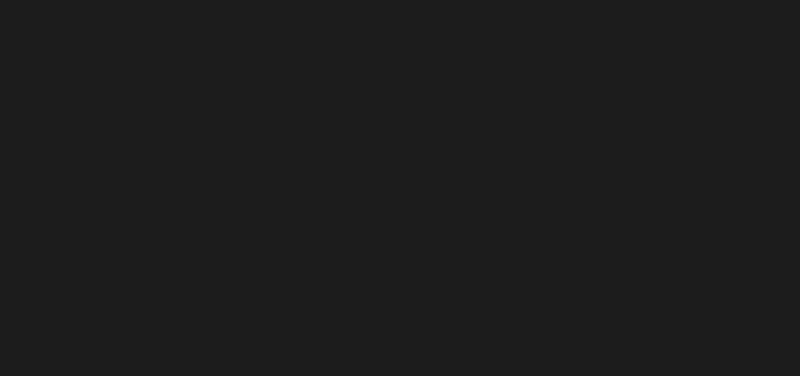

# xray 简介

!> 在使用该工具前，请确保已仔细阅读 [免责声明](https://github.com/chaitin/xray/blob/master/Disclaimer.md)，并已同意声明中的各条款。

xray 是一款功能强大的安全评估工具，由多名经验丰富的一线安全从业者呕心打造而成，主要特性有:

+ **检测速度快**。发包速度快; 漏洞检测算法高效。
+ **支持范围广**。大至 OWASP Top 10 通用漏洞检测，小至各种 CMS 框架 POC，均可以支持。
+ **代码质量高**。编写代码的人员素质高, 通过 Code Review、单元测试、集成测试等多层验证来提高代码可靠性。
+ **高级可定制**。通过配置文件暴露了引擎的各种参数，通过修改配置文件可以极大的客制化功能。
+ **安全无威胁**。xray 定位为一款安全辅助评估工具，而不是攻击工具，内置的所有 payload 和 poc 均为无害化检查。

目前支持的漏洞检测类型包括:

- XSS漏洞检测 (key: xss)
- SQL 注入检测 (key: sqldet)
- 命令/代码注入检测 (key: cmd_injection)
- 目录枚举 (key: dirscan)
- 路径穿越检测 (key: path_traversal)
- XML 实体注入检测 (key: xxe)
- 文件上传检测 (key: upload)
- 弱口令检测 (key: brute_force)
- jsonp 检测 (key: jsonp)
- ssrf 检测 (key: ssrf)
- 基线检查 (key: baseline)
- 任意跳转检测 (key: redirect)
- CRLF 注入 (key: crlf_injection)
- Struts2 系列漏洞检测 (高级版，key: struts)
- Thinkphp系列漏洞检测 (高级版，key: thinkphp)
- POC 框架 (key: phantasm)

其中 POC 框架默认内置 Github 上贡献的 poc，用户也可以根据需要自行构建 poc 并运行。

## 设计理念

1. 发最少的包做效果最好的探测。

   如果一个请求可以确信漏洞存在，那就发一个请求。如果两种漏洞环境可以用同一个 payload 探测出来，那就
   不要拆成两个。
    
1. 允许一定程度上的误报来换取扫描速度的提升

   漏洞检测工具无法面面俱到，在漏报和误报的选择上必然要选择误报。如果在使用中发现误报比较严重，可以进行反馈。
    
+ 尽量不用时间盲注等机制检测漏洞。
    
   时间检测受影响因素太多且不可控，而且可能会影响其他插件的运行。因此除非必要（如 sql）请尽量使用与时间无关的
   payload。

+ 尽量不使用盲打平台

   如果一个漏洞能用回显检测就用回显检测，因为盲打平台增加了漏洞检测过程的不确定性和复杂性。
 
+ 耗时操作谨慎处理

   全局使用 Context 做管理，不会因为某个请求而导致全局卡死。

## 简易架构

了解 xray 的整体架构可以更好的理解 cli 和配置文件的设置，方便大家更好的使用。

整体来看，扫描器这类工具大致都是由三部分组成：

1. 来源处理
1. 漏洞检测
1. 结果输出

#### 来源处理

这一部分的功能是整个漏洞检测的入口，在 xray 中我们定义了 5 个入口，分别是

+ HTTP 被动代理
+ 简易爬虫
+ 单个 URL
+ URL列表的文件
+ 单个原始 HTTP 请求文件

#### 漏洞检测

这一部分是引擎的核心功能，用于处理前面 来源处理 部分产生的标准化的请求。用户可以针对性的启用插件，配置扫描插件的参数，配置 HTTP 相关参数等。

#### 结果输出

漏洞扫描和运行时的状态统称为结果输出，xray 定义了如下几种输出方式:

+ Stdout (屏幕输出, 默认开启)
+ JSON 文件输出
+ HTML 报告输出
+ Webhook 输出

在使用 xray 的过程中只要谨记这三个部分，所有的命令行用法就看起来很简单了。 接下来就让我们上路吧。
