# 使用 xray 代理模式进行漏洞扫描

代理模式下的基本架构为，扫描器作为中间人，首先原样转发流量，并返回服务器响应给浏览器等客户端，通讯两端都认为自己直接与对方对话，同时记录该流量，然后修改参数并重新发送请求进行扫描。

## 生成 ca 证书

在浏览器使用 https 协议通信的情况下，必须要得到客户端的信任，才能建立与客户端的通信。

这里的突破口就是 ca 证书。只要自定义的 ca 证书得到了客户端的信任，xray 就能用该 ca 证书签发各种伪造的服务器证书，从而获取到通信内容。

<!-- tabs:start -->

#### ** Windows **

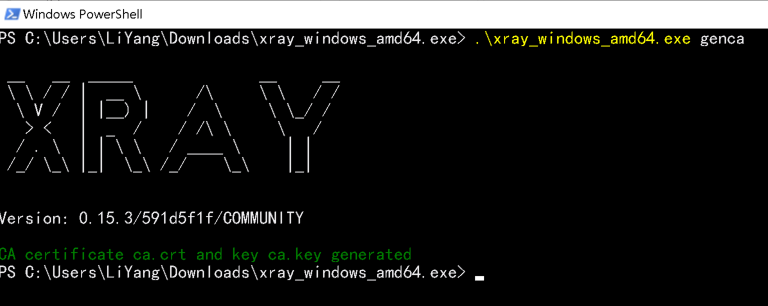

运行 `.\xray_windows_amd64.exe genca`

#### ** MacOS **

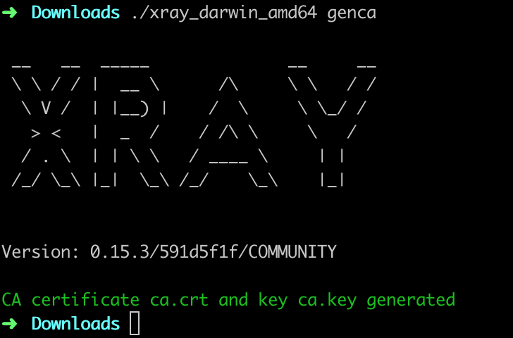

运行 `./xray_darwin_amd64 version` 即可生成 ca 证书，保存为 `ca.crt` 和 `ca.key` 两个文件。

#### ** Linux **

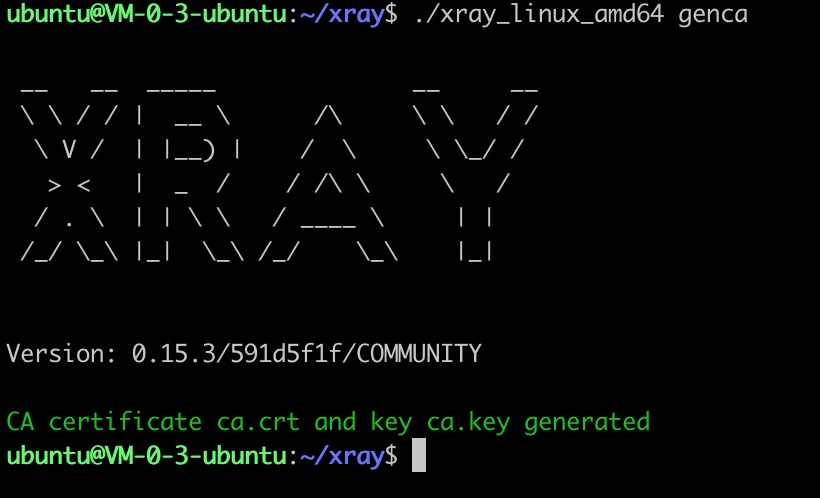

运行 `./xray_darwin_amd64 version` 即可生成 ca 证书，保存为 `ca.crt` 和 `ca.key` 两个文件。

<!-- tabs:end -->

运行命令之后，将在当前文件夹生成 `ca.crt` 和 `ca.key` 两个文件。

本命令只需要第一次使用的时候运行即可，如果文件已经存在再次运行会报错，需要先删除本地的 `ca.crt` 和 `ca.key` 文件。

## 安装 ca 证书

如果使用的是 FireFox 浏览器，请参照 xxx，它有自己的证书体系。

如果使用的是 IE、Chrome、curl 等客户端，建议将 ca 证书安装在操作系统上，请参照下方的教程。

<!-- tabs:start -->

#### ** Windows **

双击 `ca.crt`，然后按照下图的步骤操作。

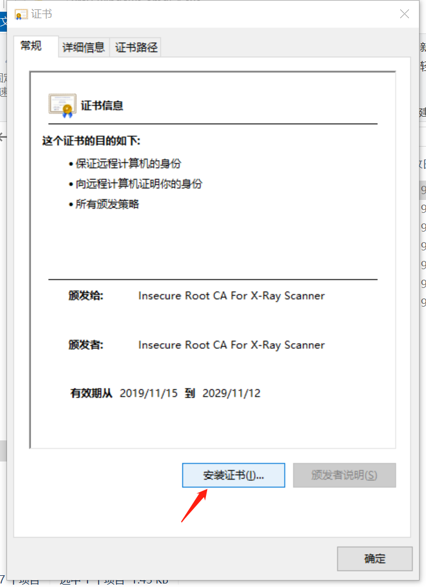

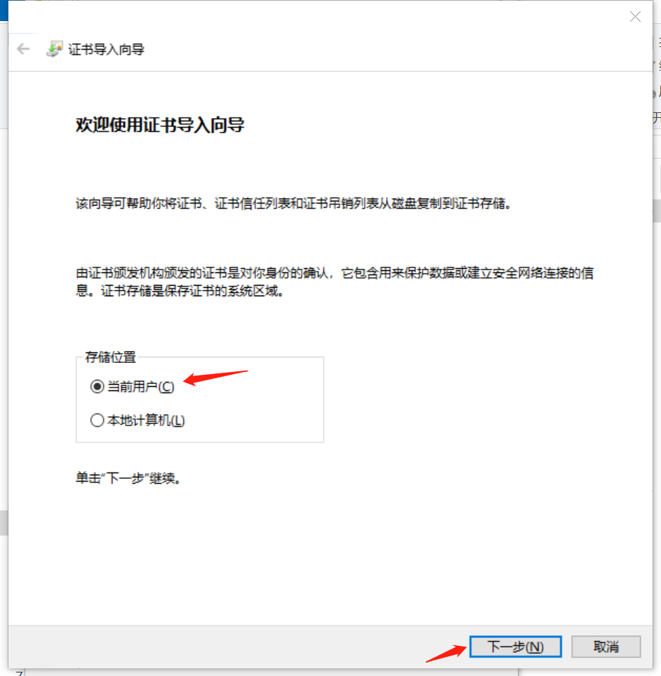

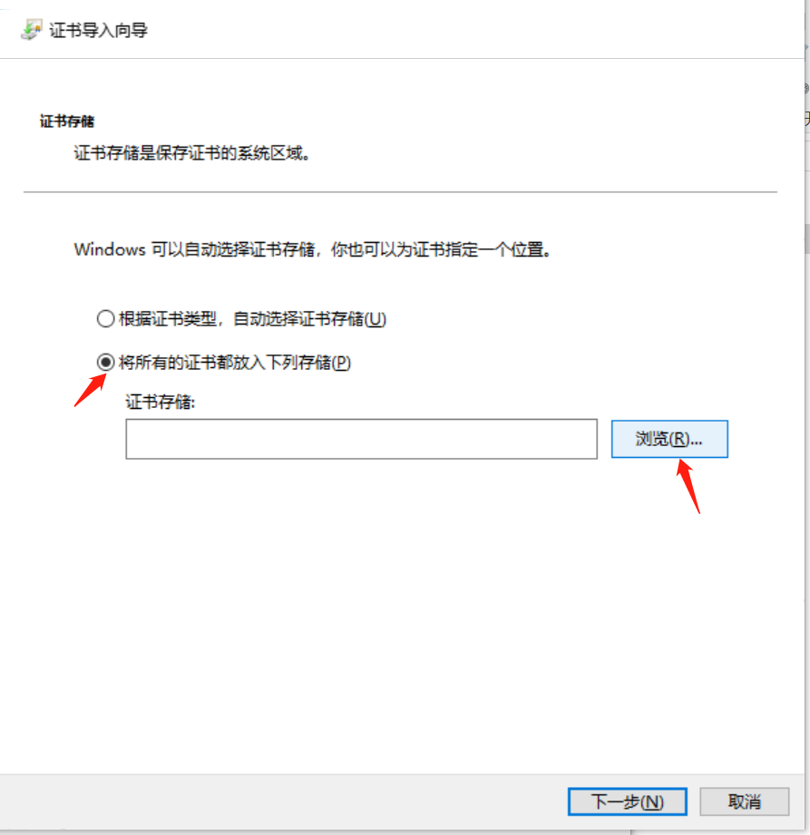
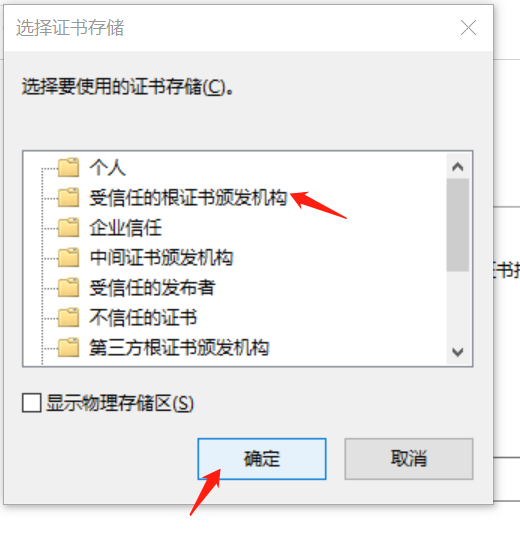
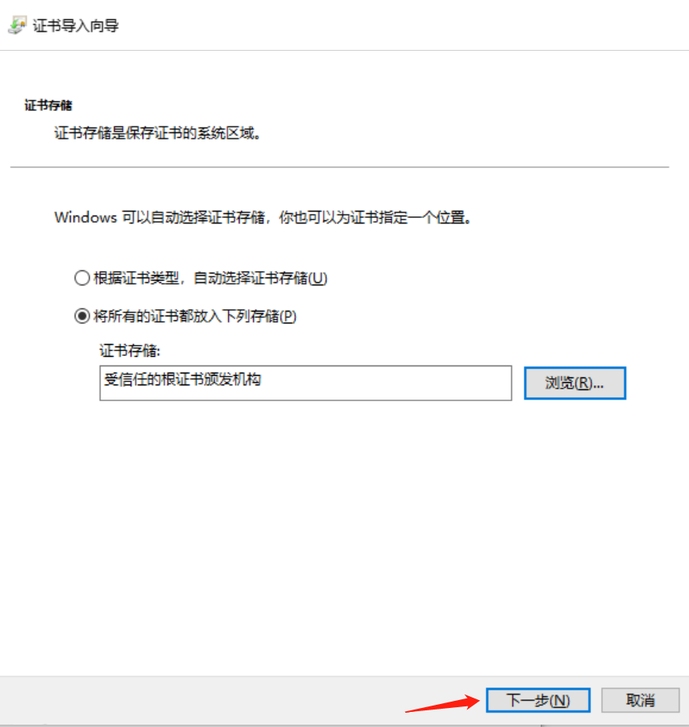
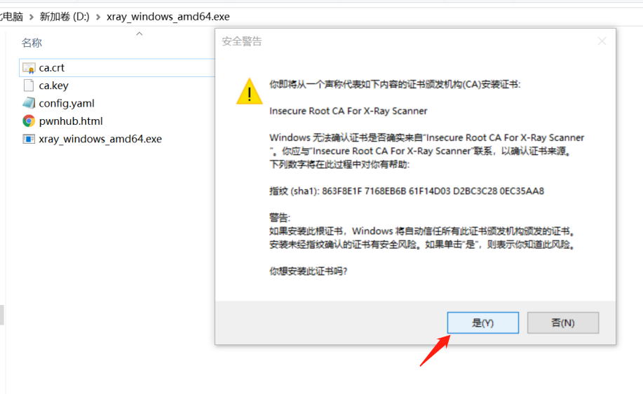
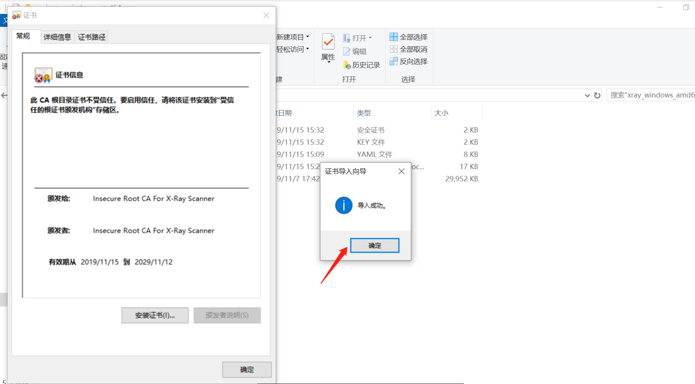

#### ** MacOS **

todo

#### ** Linux **

todo

#### ** iOS **

可以将 `ca.crt` 文件传送到手机上，然后打开

或者参考下面的步骤，将手机配置代理之后，使用浏览器访问 `http://xray/` 然后点击下载 ca 证书，然后再安装。

todo

#### ** Android **

可以将 `ca.crt` 文件传送到手机上，然后打开

或者参考下面的步骤，将手机配置代理之后，使用浏览器访问 `http://xray/` 然后点击下载 ca 证书，然后再安装。

todo

<!-- tabs:end -->

## 启动代理

<!-- tabs:start -->

#### ** Windows **

todo

#### ** MacOS **

todo

#### ** Linux **

todo

<!-- tabs:end -->

## 配置代理

todo

<!-- tabs:start -->

#### ** IE / Edge **

按照下图的步骤操作

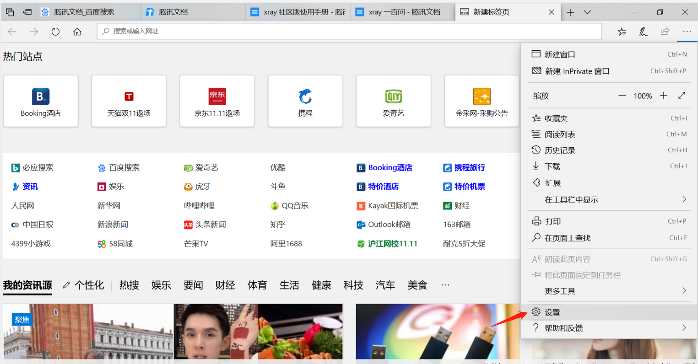
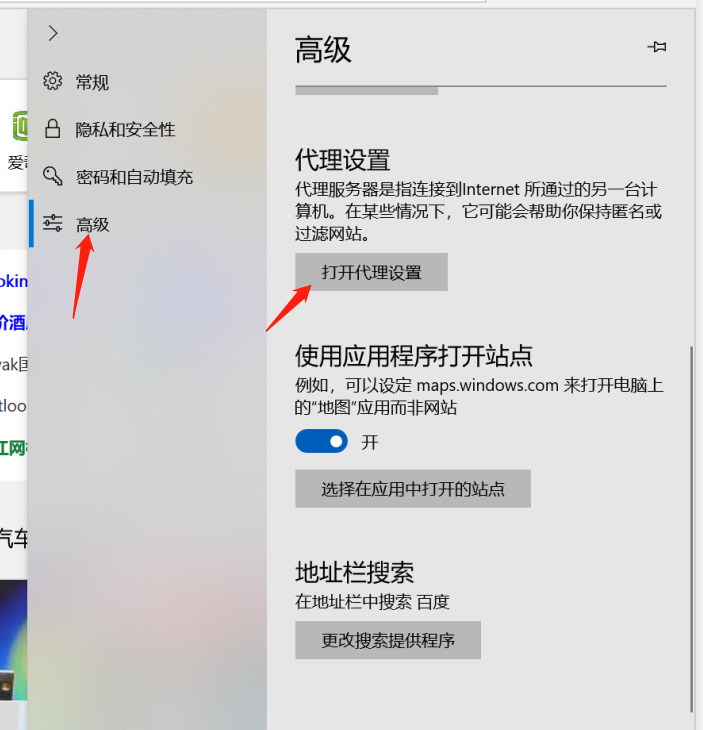
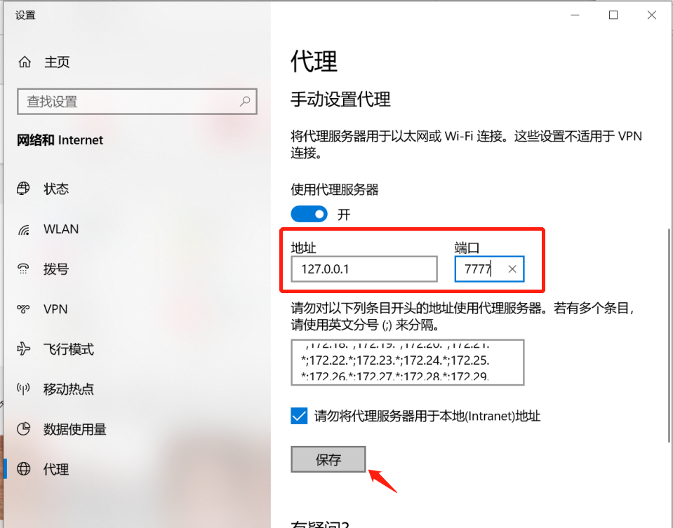

#### ** Chrome **

Chrome 可以使用操作系统的代理配置，同时也可以使用插件控制，这里推荐使用插件，可以更加灵活的去配置代理。

首先点击 [Chrome Store](https://chrome.google.com/webstore/detail/padekgcemlokbadohgkifijomclgjgif)

然后点击同意相关的协议和权限申请弹框，这样就可以在 Chrome 浏览器的右上角看到一个圆形图标的插件了。

新建情景模式，命名为 `xray`，然后 todo todo

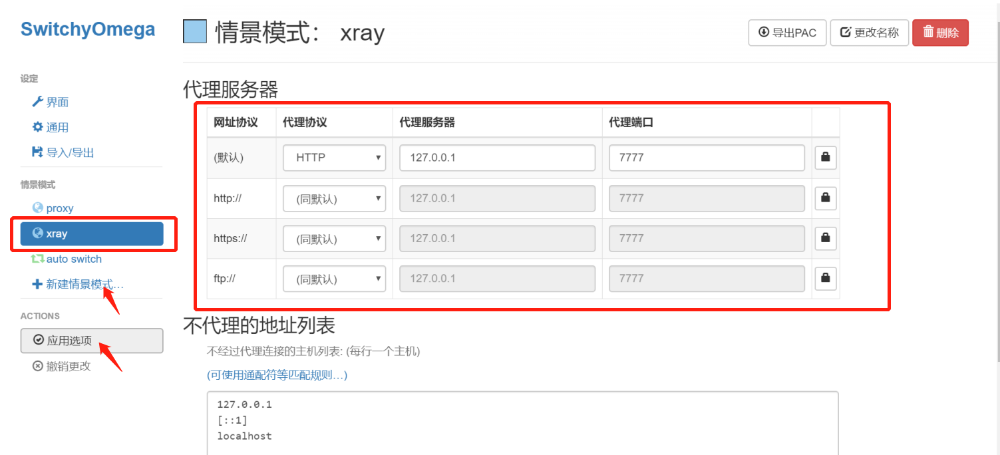

选择 `xray` 模式，这样 Chrome 就会使用 xray 作为代理了。

#### ** iOS **

todo

#### ** Android **

todo

<!-- tabs:end -->