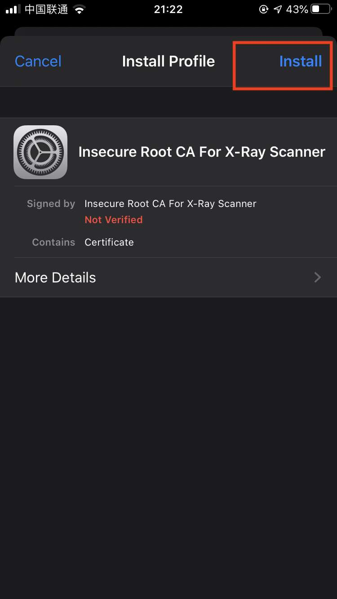
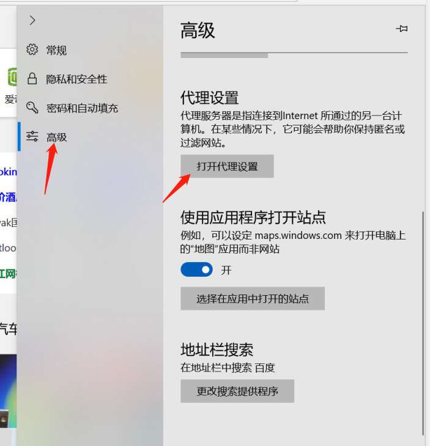

# 使用 xray 代理模式进行漏洞扫描

代理模式下的基本架构为，扫描器作为中间人，首先原样转发流量，并返回服务器响应给浏览器等客户端，通讯两端都认为自己直接与对方对话，同时记录该流量，然后修改参数并重新发送请求进行扫描。

## 生成 ca 证书

在浏览器使用 https 协议通信的情况下，必须要得到客户端的信任，才能建立与客户端的通信。

这里的突破口就是 ca 证书。只要自定义的 ca 证书得到了客户端的信任，xray 就能用该 ca 证书签发各种伪造的服务器证书，从而获取到通信内容。

<!-- tabs:start -->

#### ** Windows **


运行 `.\xray_windows_amd64.exe genca`

#### ** MacOS **


运行 `./xray_darwin_amd64 genca` 即可生成 ca 证书，保存为 `ca.crt` 和 `ca.key` 两个文件。

#### ** Linux **


运行 `./xray_darwin_amd64 genca` 即可生成 ca 证书，保存为 `ca.crt` 和 `ca.key` 两个文件。

<!-- tabs:end -->

运行命令之后，将在当前文件夹生成 `ca.crt` 和 `ca.key` 两个文件。

本命令只需要第一次使用的时候运行即可，如果文件已经存在再次运行会报错，需要先删除本地的 `ca.crt` 和 `ca.key` 文件。

## 安装 ca 证书

如果使用的是 FireFox 浏览器，请参照[这里](https://wiki.wmtransfer.com/projects/webmoney/wiki/Installing_root_certificate_in_Mozilla_Firefox)，它有自己的证书体系。

如果使用的是 IE、Chrome、curl 等客户端，建议将 ca 证书安装在操作系统上，请参照下方的教程。

<!-- tabs:start -->

#### ** Windows **

双击 `ca.crt`，然后按照下图的步骤操作。


#### ** MacOS **

双击 `ca.crt`，然后按照下图的步骤操作。

右上角搜索 `x-ray`，可以看到一条记录，有一个红叉，被标记为不受信任的。


然后双击这条记录，将 `SSL` 那一项改为始终信任，然后点击左上角关闭窗口，输入密码授权。


#### ** Linux **

将 `ca.crt` 复制到 `/usr/local/share/ca-certificates/`，然后执行 `update-ca-certificates`。

```
sudo cp ca.crt /usr/local/share/ca-certificates/xray.crt
sudo update-ca-certificates
```


#### ** iOS **

可以将 `ca.crt` 文件传送到手机上，然后点击打开打开。

或者参考后续的步骤，将手机配置代理之后，使用浏览器访问 `http://xray/` 然后点击下载 ca 证书，然后再安装。


然后去设置首页，查看下载的描述文件。


点击右上角安装，输入密码授权。



点击通用设置-关于，在最后一项证书信任设置中，将 `Insecure Root CA For X-Ray Scanner` 一项的开关打开。


#### ** Android **

可以将 `ca.crt` 文件传送到手机上，然后打开

或者参考下面的步骤，将手机配置代理之后，使用浏览器访问 `http://xray/` 然后点击下载 ca 证书，然后再安装。


<!-- tabs:end -->

## 启动代理

在扫描之前，我们还需要做一些必要的设置

第一次启动 xray 之后，当前目录会生成 `config.yml` 文件，选择文件编辑器打开，并按照下方说明修改。

 - `mitm` 中 `restriction` 中 `includes` 由 `*` 改为 `testphp.vulnweb.com`

```
mitm:
  ...
  restriction:
    includes:
    - "testphp.vulnweb.com"
```

因为我们的测试目标站就是 `http://testphp.vulnweb.com`，增加这个过滤之后，xray 将只会扫描该站的流量，避免扫描到非授权目标站点。

对于配置文件中的更多解读，请参考文档中的 `配置` 章节。

 - 设定漏洞扫描结果的输出，这里选择使用 html 文件输出，所以命令行后面要增加 `--html-output xray-testphp.html`。

<!-- tabs:start -->

#### ** Windows **

```
.\xray_windows_amd64.exe webscan --listen 127.0.0.1:7777 --html-output xray-testphp.html
```


#### ** MacOS **

```
./xray_darwin_amd64 webscan --listen 127.0.0.1:7777 --html-output xray-testphp.html
```


#### ** Linux **


```
./xray_linux_amd64 webscan --listen 127.0.0.1:7777 --html-output xray-testphp.html
```

<!-- tabs:end -->

常见问题

 - 如何退出？`ctrl` + `c`
 - 提示 `file xray-testphp.html already exists`，可以删除已经存在的报告文件，或者使用一个新的文件名，或者在文件名中加入 `__timestamp__` 或 `__datetime__` 将自动替换为实际值。

## 配置代理

!> 注意，下面的配置可能和上面命令的端口不一致，请按照实际情况填写

<!-- tabs:start -->

#### ** IE / Edge **

按照下图的步骤操作





#### ** Chrome **

Chrome 可以使用操作系统的代理配置，同时也可以使用插件控制，这里推荐使用插件，可以更加灵活的去配置代理。

首先点击 [Chrome Store](https://chrome.google.com/webstore/detail/padekgcemlokbadohgkifijomclgjgif)

然后点击同意相关的协议和权限申请弹框，这样就可以在 Chrome 浏览器的右上角看到一个圆形图标的插件了。

新建情景模式，命名为 `xray`，然后 todo todo


选择 `xray` 模式，这样 Chrome 就会使用 xray 作为代理了。


#### ** FireFox **

todo

#### ** iOS **

按照下图的步骤操作


#### ** Android **

todo

<!-- tabs:end -->

## 开始扫描

使用浏览器访问 http://testphp.vulnweb.com/

然后就可以看到 xray 界面开始输出漏洞信息，下面是几个快速链接，可以点击用于体验更多的漏洞类型的扫描

 - http://testphp.vulnweb.com/listproducts.php?cat=1
 - http://testphp.vulnweb.com/artists.php?artist=2
 - http://testphp.vulnweb.com/redir.php?r=http://www.w3.org


