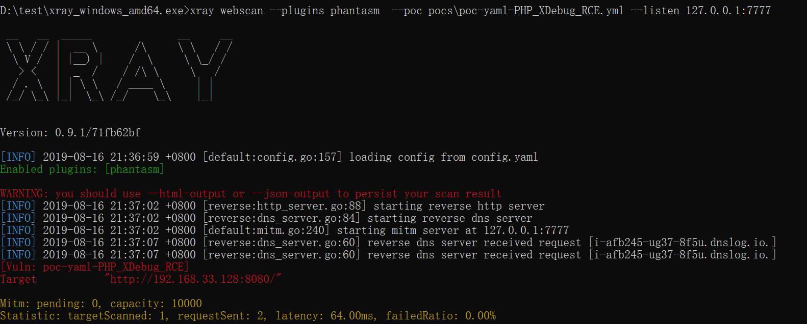

## XDebug 远程调试漏洞（代码执行）检测Poc

在X-Forwarded-For中使用DNSLog进行检测。需要开启Xray的DNSLog功能。

Docker这块偷了个懒，用的vulhub的Dockerfile，需要修改docker-compose.yml的DNS参数为Xray的IP地址用于测试。

**顺便提个建议：**其实Poc里应该能设定扫描层级范围，像这种洞基本根目录扫描一次就够了。

