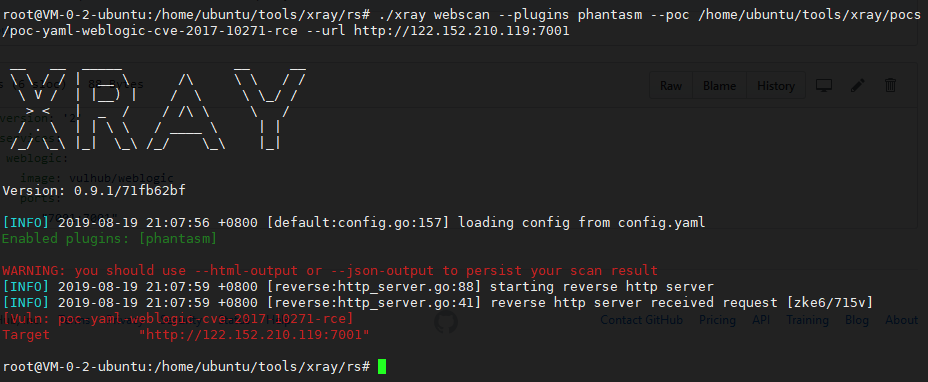

# Weblogic < 10.3.6 'wls-wsat' XMLDecoder 反序列化漏洞POC（CVE-2017-10271）

我是在腾讯云上搭的靶场和扫描器

反连平台配置参考 https://chaitin.github.io/xray/#/guide/reverse 场景2

即

```
reverse:
  store_events: false
  token: ""
  http:
    enabled: true
    listen_ip: 0.0.0.0
    listen_port: ""
  dns:
    enabled: false
    listen_ip: 0.0.0.0
    domain: ""
  client:
    # 上面的 port 留空代表自动选择，这里 ${port} 引用上面自动选择的值
    http_base_url: "http://your-reverse-server-ip:${port}"
    dns_server_ip: "your-reverse-server-ip"
    remote_server: false
```

靶场里没nslookup，curl命令，所以我用了wget做验证。

docker是直接用vulhub里面的。

