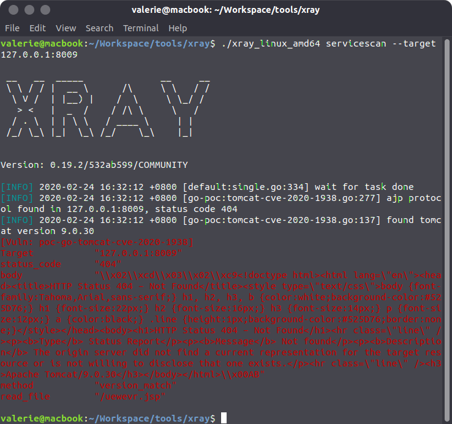
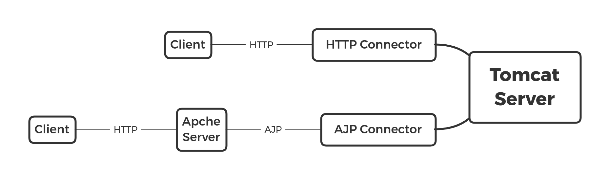

# XRAY新功能使用体验和Ghostcat漏洞分析

## 0x00 漏洞信息

- CVE-2020-1938
- CNVD-2020-10487

## 0x01 漏洞描述

Ghostcat (幽灵猫, CNVD-2020-10487/CVE-2020-1938)是由长亭科技安全研究员发现的存在于Tomcat中的安全漏洞，由于Tomcat AJP协议设计上存在缺陷，攻击者通过Tomcat AJP Connector可以读取或包含Tomcat上所有webapp目录下的任意文件，例如可以读取webapp配置文件或源代码。此外在目标应用有文件上传功能的情况下，配合文件包含的利用还可以达到远程代码执行的危害。

对于处在漏洞影响版本范围内的Tomcat而言，若其开启AJP Connector且攻击者能够访问AJP Connector服务端口的情况下，即存在被Ghostcat漏洞利用的风险。注意AJP Connector默认配置下即为开启状态，且监听在0.0.0.0:8009。

## 0X02 影响范围

- Apache Tomcat 6
- Apache Tomcat 7 < 7.0.100
- Apache Tomcat 8 < 8.5.51
- Apache Tomcat 9 < 9.0.31

## 0x03 漏洞检测

自行编写并打包war文件前注意在`pom.xml`中添加合适的tomcat版本。

```xml
<dependency>
    <groupId>org.apache.tomcat</groupId>
    <artifactId>tomcat-servlet-api</artifactId>
    <version>9.0.30</version>
    <scope>provided</scope>
</dependency>
```

编写DockerFile。

```sh
# PhoenixDockerFile
FROM tomcat:9.0.30
ADD demo.war /usr/local/tomcat/webapps/
CMD ["catalina.sh", "run"]
```

运行docker，并使用xray服务扫描。

```sh
docker build -f DemoDockerFile -t demo:latest .
docker run -it -p 8009:8009 8080:8080 demo
./xray_linux_amd64 servicescan --target 127.0.0.1:8009
```



## 0x04 原理分析

### AJP Connector

Apache Tomcat服文件务器通过Connector连接器组件与客户程序建立连接，Connector表示接收请求并返回响应的端点。即Connector组件负责接收客户的请求，以及把Tomcat服务器的响应结果发送给客户。AJP (AJPv13)协议是定向包协议。出于性能考虑选择了二进制格式传输纯文本信息。它能减少Web服务器通过TCP连接与Servlet容器进行通信时，高开销套接字的创建，降低HTTP请求的处理成本。因此主要在需要集群、反向代理的场景被使用。因此AJP Connector是Apache Tomcat为了优化性能而开发的采用AJPv13协议的Connector。

在`conf/server.xml`文件中HTTP Connector配置如下:

```xml
<Connector port="8080" protocol="HTTP/1.1" connectionTimeout="20000" redirectPort="8443" />
```

AJP Connector配置如下:

```xml
<Connector port="8009" protocol="AJP/1.3" redirectPort="8443" />
```

客户端通过HTTP Connector和AJP Connector能以两种方式访问服务器资源。



### 漏洞代码

修复前的apache-tomcat-9.0.30-src代码中的问题函数关键部分如下所示，省略的代码以注释形式保留。标注`HERE`部分的代码未经过任何数据清洗就将数据传入。

```java
// apache-tomcat-9.0.30-src/java/org/apache/coyote/ajp/AjpProcessor.java
/**
* After reading the request headers, we have to setup the request filters.
*/
private void prepareRequest() {
   // Translate the HTTP method code to a String.
   // Decode headers
   // Decode extra attributes
   String requiredSecret = protocol.getRequiredSecret();
   boolean secret = false;
   byte attributeCode;
   while ((attributeCode = requestHeaderMessage.getByte()) != Constants.SC_A_ARE_DONE) {
      switch (attributeCode) {
      case Constants.SC_A_REQ_ATTRIBUTE:
            requestHeaderMessage.getBytes(tmpMB);
            String n = tmpMB.toString();
            requestHeaderMessage.getBytes(tmpMB);
            String v = tmpMB.toString();
            /*
            * AJP13 misses to forward the local IP address and the
            * remote port. Allow the AJP connector to add this info via
            * private request attributes.
            * We will accept the forwarded data and remove it from the
            * public list of request attributes.
            */
            if(n.equals(Constants.SC_A_REQ_LOCAL_ADDR)) {
               request.localAddr().setString(v);
            } else if(n.equals(Constants.SC_A_REQ_REMOTE_PORT)) {
               try {
                  request.setRemotePort(Integer.parseInt(v));
               } catch (NumberFormatException nfe) {
                  // Ignore invalid value
               }
            } else if(n.equals(Constants.SC_A_SSL_PROTOCOL)) {
               request.setAttribute(SSLSupport.PROTOCOL_VERSION_KEY, v);
            } else {
               request.setAttribute(n, v); // HERE
            }
            break;
      // case Constants.SC_A_CONTEXT: {...}
      // case Constants.SC_A_SERVLET_PATH: {...}
      // case Constants.SC_A_REMOTE_USER: {...}
      // case Constants.SC_A_AUTH_TYPE: {...}
      // case Constants.SC_A_QUERY_STRING: {...}
      // case Constants.SC_A_JVM_ROUTE: {...}
      // case Constants.SC_A_SSL_CERT: {...}
      // case Constants.SC_A_SSL_CIPHER: {...}
      // case Constants.SC_A_SSL_SESSION: {...}
      // case Constants.SC_A_SSL_KEY_SIZE: {...}
      // case Constants.SC_A_STORED_METHOD: {...}
      // case Constants.SC_A_SECRET: {...}
      default:
            // Ignore unknown attribute for backward compatibility
            break;
      }
   }
   // Check if secret was submitted if required
   // Check for a full URI (including protocol://host:port/)
}

// apache-tomcat-9.0.30-src/java/org/apache/coyote/ajp/Constants.java
// Integer codes for common (optional) request attribute names
public static final byte SC_A_CONTEXT       = 1;  // XXX Unused
public static final byte SC_A_SERVLET_PATH  = 2;  // XXX Unused
public static final byte SC_A_REMOTE_USER   = 3;
public static final byte SC_A_AUTH_TYPE     = 4;
public static final byte SC_A_QUERY_STRING  = 5;
public static final byte SC_A_JVM_ROUTE     = 6;
public static final byte SC_A_SSL_CERT      = 7;
public static final byte SC_A_SSL_CIPHER    = 8;
public static final byte SC_A_SSL_SESSION   = 9;
public static final byte SC_A_SSL_KEY_SIZE  = 11;
public static final byte SC_A_SECRET        = 12;
public static final byte SC_A_STORED_METHOD = 13;
// Used for attributes which are not in the list above
public static final byte SC_A_REQ_ATTRIBUTE = 10;
/**
* AJP private request attributes
*/
public static final String SC_A_REQ_LOCAL_ADDR  = "AJP_LOCAL_ADDR";
public static final String SC_A_REQ_REMOTE_PORT = "AJP_REMOTE_PORT";
public static final String SC_A_SSL_PROTOCOL    = "AJP_SSL_PROTOCOL";
```

执行到包含漏洞代码的`else`的条件是:
- n不等于`Constants.SC_A_REQ_LOCAL_ADDR`即AJP_LOCAL_ADDR
- n不等于`Constants.SC_A_REQ_REMOTE_PORT`即AJP_REMOTE_PORT
- n不等于`Constants.SC_A_SSL_PROTOCOL`即AJP_SSL_PROTOCOL

要搞清`HERE`标记处的`request.setAttribute`和`request.getAttribute`二者配对使用，因为AJP实现代码未对输入数据进行清理，所以通信时DefaultServlet调用包含`request.getAttribute`的函数时，将会取出不可信的数据。

```java
// apache-tomcat-9.0.30-src/java/org/apache/catalina/servlets/DefaultServlet.java
protected String getRelativePath(HttpServletRequest request, boolean allowEmptyPath) {
   String servletPath;
   String pathInfo;
   if (request.getAttribute(RequestDispatcher.INCLUDE_REQUEST_URI) != null) {
      pathInfo = (String) request.getAttribute(RequestDispatcher.INCLUDE_PATH_INFO);
      servletPath = (String) request.getAttribute(RequestDispatcher.INCLUDE_SERVLET_PATH);
   } else {
      pathInfo = request.getPathInfo();
      servletPath = request.getServletPath();
   }
   StringBuilder result = new StringBuilder();
   if (servletPath.length() > 0) {
      result.append(servletPath);
   }
   if (pathInfo != null) {
      result.append(pathInfo);
   }
   if (result.length() == 0 && !allowEmptyPath) {
      result.append('/');
   }
   return result.toString();
}

// apache-tomcat-9.0.30-src/java/javax/servlet/RequestDispatcher.java
static final String INCLUDE_REQUEST_URI = "javax.servlet.include.request_uri";
static final String INCLUDE_PATH_INFO = "javax.servlet.include.path_info";
static final String INCLUDE_SERVLET_PATH = "javax.servlet.include.servlet_path";
```

黑客可以通过控制`javax.servlet.include.request_uri`、`javax.servlet.include.path_info`、`javax.servlet.include.servlet_path`这三个属性构造payload进行攻击。

### 任意文件读取

通信时通过一系列调用最终在`serveResource`函数中调用了包含`request.getAttribute`的`getResource`，因为变量path是黑客可以控制的变量，所以在执行`resources.getResource(path)`时可以造成任意文件读取。

```java
// apache-tomcat-9.0.30-src/java/org/apache/catalina/servlets/DefaultServlet.java
@Override
protected void service(HttpServletRequest req, HttpServletResponse resp) throws ServletException, IOException {
   if (req.getDispatcherType() == DispatcherType.ERROR) {
      doGet(req, resp);
   } else {
      super.service(req, resp);
   }
}

/**
* Process a GET request for the specified resource.
*
* @param request The servlet request we are processing
* @param response The servlet response we are creating
*
* @exception IOException if an input/output error occurs
* @exception ServletException if a servlet-specified error occurs
*/
@Override
protected void doGet(HttpServletRequest request, HttpServletResponse response) throws IOException, ServletException {
   // Serve the requested resource, including the data content
   serveResource(request, response, true, fileEncoding);
}

/**
* Serve the specified resource, optionally including the data content.
*
* @param request       The servlet request we are processing
* @param response      The servlet response we are creating
* @param content       Should the content be included?
* @param inputEncoding The encoding to use if it is necessary to access the
*                      source as characters rather than as bytes
*
* @exception IOException if an input/output error occurs
* @exception ServletException if a servlet-specified error occurs
*/
protected void serveResource(HttpServletRequest request, HttpServletResponse response, boolean content, String inputEncoding) throws IOException, ServletException {
   boolean serveContent = content;
   // Identify the requested resource path
   String path = getRelativePath(request, true);
   // if (debug > 0) {...}
   if (path.length() == 0) {
      // Context root redirect
      doDirectoryRedirect(request, response);
      return;
   }
   WebResource resource = resources.getResource(path);
   boolean isError = DispatcherType.ERROR == request.getDispatcherType();
   // ...
}
```

### 任意代码执行

通信时在调用了包含`request.getAttribute`的`service`，因为变量jspUri是黑客可以控制的变量，所以在执行`serviceJspFile(request, response, jspUri, precompile)`时，若服务器碰巧能上传文件，黑客则可以通过上传包含shell的jsp文件达到任意代码执行的目的。


```java
// apache-tomcat-9.0.30-src/java/org/apache/jasper/servlet/JspServlet.java
@Override
public void service (HttpServletRequest request, HttpServletResponse response) throws ServletException, IOException {
   String jspUri = jspFile;
   if (jspUri == null) {
      jspUri = (String) request.getAttribute(RequestDispatcher.INCLUDE_SERVLET_PATH);
      if (jspUri != null) {
         String pathInfo = (String) request.getAttribute(RequestDispatcher.INCLUDE_PATH_INFO);
         if (pathInfo != null) {
            jspUri += pathInfo;
         }
      } else {
         jspUri = request.getServletPath();
         String pathInfo = request.getPathInfo();
         if (pathInfo != null) {
            jspUri += pathInfo;
         }
      }
   }
   // if (log.isDebugEnabled()) {...}
   try {
      boolean precompile = preCompile(request);
      serviceJspFile(request, response, jspUri, precompile);
   } catch (RuntimeException e) {
      throw e;
   } catch (ServletException e) {
      throw e;
   } catch (IOException e) {
      throw e;
   } catch (Throwable e) {
      ExceptionUtils.handleThrowable(e);
      throw new ServletException(e);
   }
}
```

## 0x05 参考资料

1. https://www.chaitin.cn/zh/ghostcat
2. https://www.anquanke.com/post/id/199351
3. https://www.anquanke.com/post/id/199448
4. http://archive.apache.org/dist/tomcat/